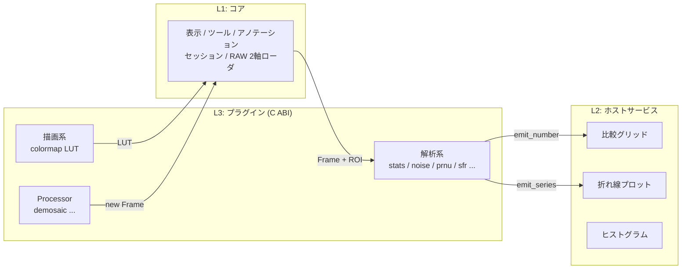

# viewer

**画質設計のためのエンジニアリング画像ビューワ** — npy / RAW / Bayer を開いて、見て、測る。

[](https://github.com/klimemam/viewer/actions)
Windows / Linux / macOS ・ C++17 + Dear ImGui ・ GPU/CUDA 不要 ・ 単体バイナリ + プラグイン

> 「JPEG ビューワでセンサダンプは見られない」——このツールは逆です。
> `RGGB float32 のベタバイナリ` を開き、画素値を座標付きで読み、ROI を置いて
> ノイズ・PRNU・SFR をその場で測るための道具です。

<!-- TODO: スクリーンショット (docs/img/hero.png) を実機キャプチャ後にここへ -->

## ハイライト

| | |
|---|---|
| 🔢 **エンジニアリングデータを直接開く** | `.npy`(u8〜f64、CHW/HWC/バッチ、BE/Fortran 可)、ベタ RAW(**画素フォーマット × 解釈の2軸指定**——RGGB float32 も一発)、Bayer / Quad Bayer |
| 🔍 **ピクセルが見える** | ホバーで座標+ch毎の値(CFA チャンネル名付き)、座標ルーラー、ピクセルグリッド、黒点/白点レンジ、ガンマ、viridis カラーマップ |
| 📐 **複数 ROI・複数 POI** | モード切替なし(押した場所で決まる)、`X`/`Y` で**行/列の1ライン選択**、選択 ROI から**動的クロップ⇔復元**。ROI ウィンドウに**基本統計(mean/std/min/max)を常時表示** |
| 🪟 **パネルは自由配置** | ドッキング/タブ/フロート、レイアウトは自動保存。ROI と詳細解析はフローティング既定 |
| 🎞 **連番は「塊」として扱う** | 1枚開けば同フォルダの連番を裏で一括ロード(検出は"変化する数字フィールド")。**フォルダを開けば `A/00/`, `A/01/` … を複数の塊として一度に**(RAW の書式指定は1回だけ)。`←→`/`C-f C-b` で時間方向、`↑↓`/`C-n C-p` で塊移動 |
| 🆚 **A/B 比較** | `\` で **ワイプ(真ん中の仕切りをドラッグ)⇔ 並べて ⇔ 差分(A−B)**。ズーム/位置は常に共通、Inspector に **A / B / A−B** の画素値。`B` 長押しで B 全面、`Shift+B` で**同じ塊のフレーム同士**を比較。差分は**符号=色相・大きさ=明るさ**、スケール自動+**はみ出し画素を明示** |
| 📊 **その場で測る** | 常時表示の mean/std/var + ヒストグラム(CFA 4ch 分離・ROI 追従)、連番なら**時間ノイズ vs 固定パターン**も常時表示。加えて解析プラグイン: ノイズフロア / **PRNU・FPN** / シャープネス / **ISO 12233 e-SFR(カーブ表示)**。結果は **ROI × 指標の比較グリッド** |
| 🔌 **C ABI プラグインで成長** | 測定は全部プラグイン([include/ps/ps_plugin.h](include/ps/ps_plugin.h))。C ファイル1個+CMake 1行で Measure メニューと UI が自動でついてくる |
| 💾 **状態を丸ごと持ち運ぶ** | セッション(.vsession): 画像のレシピ(.npz の配列名まで)・塊ごとの表示フレーム・ズーム位置・ROI/ピン・レンジ・**パネル配置**・比較状態を保存/復元。**クラッシュしても直前の状態が残る**。CLI からも `--session` |

## クイックスタート

**A. ビルド済みバイナリ**: [Actions](../../actions) の最新 run → Artifacts →
`viewer-win64` / `viewer-linux-x64` / `viewer-macos-arm64` をダウンロード
(zip/tgz に `plugins/` 同梱。Linux/macOS は `tar xzf` → `./viewer`)。
デスクトップ/スタートメニューから起動したい場合は同梱の `install_shortcut.cmd`
(Linux/macOS は `install_shortcut.sh`)—— [startup.md](docs/startup.md#0-2-デスクトップ--スタートメニューから起動する)。

**B. ソースから** (VS2022 / MinGW / gcc / clang + CMake 3.21+、依存は自動取得):
```bash
cmake -S . -B build -DCMAKE_BUILD_TYPE=Release
cmake --build build --config Release
./build/viewer                       # Windows: build\Release\viewer.exe
```
Linux は `xorg-dev libgl1-mesa-dev` 等が必要([CI 設定](.github/workflows/build.yml)参照)。
MinGW 同梱 CMake で SSL エラーが出る場合は
[manual の対処](docs/manual.md#ビルド環境まわり-windows)を参照。

**3分ツアー**:
```bash
python tools/gen_testdata.py         # テスト画像生成
./build/viewer tools/testdata/cfa_rggb_640x480_bayer16.raw
```
1. ヒストグラムが **R/Gr/Gb/B の4色**に分かれて表示される(右パネル)
2. ドラッグで ROI 作成 → Analysis に **noise/floor** の結果が ROI 毎の列で出る
3. **Process > demosaic (bilinear)** → RGB 画像が新規タブに
4. `./build/viewer tools/testdata/slant_edge_f32.npy` → エッジに ROI → **Measure > iso12233 > e-sfr** → SFR カーブ+MTF50

## 代表ワークフロー

<details><summary><b>1. センサダンプの検分</b>(フォーマット不明の RAW を開く)</summary>

1. ファイルをウィンドウへドラッグ → RAW ダイアログが開く
2. **pixel format**(u8/u16/f32/f64 + エンディアン)と **interpretation**(Gray/RGB/.../Bayer)を選ぶ
   —— サイズはファイルサイズから自動候補、ファイル名の `1920x1080` `rggb` `f32` も自動認識
3. 開いた後も右パネル **Interpret** で Gray⇔Bayer⇔Quad を即切替、**Reinterpret raw...** で読み直し
4. 巨大ダンプは **crop on load** か、開いてから ROI →「Crop to selected ROI」(「Restore full」で復帰)
</details>

<details><summary><b>2. パッチ比較測定</b>(グレーチャート/フラット評価)</summary>

1. 各パッチをドラッグして ROI(注目画素は `P` でピン)
2. Measure > **stats/moments** または **noise/floor** → 右パネルに ROI × 指標のグリッド
3. フラット画像なら **uniformity/prnu-fpn** で PRNU% / 行・列バンディング / シェーディング
4. `Ctrl+S` でセッション保存 → 翌日 `--session` で同じ ROI 配置・ズームから再開
</details>

<details><summary><b>3. SFR / 解像力測定</b>(ISO 12233 簡易 e-SFR)</summary>

1. スランテッドエッジ(傾き 5〜40°)に ROI(複数可: 中心/周辺の比較など)
2. Measure > **iso12233 > e-sfr** → SFR カーブが ROI 色で重畳プロット、MTF50/MTF20 がグリッドに
3. CFA 画像は先に Process > demosaic
</details>

## チートシート

| 操作 | キー/マウス |
|---|---|
| ROI 作成 / 移動 / リサイズ | **ドラッグ**(ROI 内=移動、角=リサイズ)——モード切替なし |
| ピン追加 | カーソルを合わせて **`P`**(または右クリック→ Add pin here) |
| その場の操作 | **右クリック**(ピン追加 / 行・列バンド / クロップ / 削除 / フィット) |
| パン | **中ボタン / Space+ドラッグ**・ホイール=縦 / Shift+ホイール=横 |
| ズーム | **Ctrl+ホイール**(カーソル中心)・`+`/`-`・`1`=等倍・`F`=フィット |
| 行・列の選択 | `X` / `Y` ——ピン選択中はその**1ライン**、無選択ならカーソル位置の1ライン、ROI 選択中は全幅/全高トグル(再押下で復元) |
| アノテーション削除 / 選択解除 | `Del` / `Esc` |
| フレーム移動(時間方向)/ 塊移動 | `←` `→`・`Ctrl+B` `Ctrl+F` / `↑` `↓`・`Ctrl+P` `Ctrl+N`(先頭末尾: `Home`/`End`) |
| 開く / セッション保存 / 画像を閉じる | `Ctrl+O` / `Ctrl+S` / `Ctrl+W`(macOS は Cmd) |
| A/B 比較(ワイプ⇔並べて⇔差分)/ A⇄B 入替 | `\` or `C` / `Shift+\` |
| B を全面表示 / このフレームを B に固定 / 仕切り移動 | `B` 長押し / `Shift+B` / `[` `]` |
| ピクセルグリッド / ヘルプ | `G`(8倍以上)/ `H` |

**詳細マニュアル → [docs/manual.md](docs/manual.md)** ・ 測定の中身 → [docs/analyzers.md](docs/analyzers.md)

## 対応フォーマット

| 入力 | 詳細 |
|---|---|
| `.npy` | u8/i8/u16/i16/u32/i32/f32/f64/bool。(H,W)・(H,W,C)・(C,H,W)、**(F,H,W[,C]) はフレーム軸として塊に**。BE/Fortran 対応 |
| `.npz` | `savez`(非圧縮)・`savez_compressed`(deflate)の両対応、zip64 可。全配列を読み込み |
| `.bin` `.raw` `.yuv` ほか | 2軸指定: {u8,u16,f32,f64}×{Gray,RGB,BGR,RGBA,BGRA,Bayer,Quad Bayer}、オフセット/エンディアン/**crop** |
| `.vsession` | セッション(画像レシピ+表示状態+アノテーション) |

## アーキテクチャ



- 契約は [include/ps/ps_plugin.h](include/ps/ps_plugin.h) のみ(v1 プラグインは永久サポート)
- 設計の全体像・機能追加の建付け → [ARCHITECTURE.md](ARCHITECTURE.md)

## ロードマップ

1. ~~表示/検査/アノテーション/RAW 2軸/解析基盤~~ ← **いまここ(全部入り)**
2. 連番・動画(先読み再生、A/B 同期)+ マルチフレーム ABI → **EMVA 1288**
3. CUDA / NVDEC(ゼロコピー表示。無い環境は CPU に自動フォールバック)
4. params_schema → 測定パラメータ UI 自動生成、pybind11 埋め込み
5. WebSocket ブリッジ([pixelscope.html](pixelscope.html) をリモートフロントエンドに)

## UI テーマ("Aurora")

本体には [core/ui_theme.cpp](core/ui_theme.cpp) の "Aurora" テーマが組み込まれており、
**View > Theme** からダーク/ライトとアクセント5色を実行中に切り替えられます。
設計値と根拠、「ImGui 感を消す」テクニック集は
**[docs/imgui_modern_design.md](docs/imgui_modern_design.md)** に。
色の試行錯誤用に Python 製ライブデモも同梱しています:

```bash
pip install -r requirements-imgui.txt
python imgui_demo.py     # Design Lab パネルでダーク/ライト・アクセント色を実機確認
```
