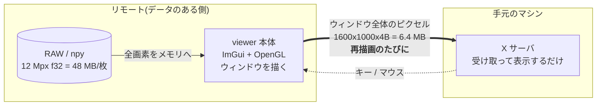

現行ドキュメント: [remote.md](../remote.md) の背景 — `ssh -X` が遅かった理由、ssh 標準入出力を選んだ利点、当初の WebSocket ブリッジとの関係、却下した他の選択肢。

# リモートのデータを手元から見る (`ssh://`) — 経緯と検討

## 1. いま何が遅いのか — 「送る単位」の問題

この viewer は**即時モード UI**(Dear ImGui)です。パネルの状態を保持したウィジェット
ツリーは持たず、毎フレーム全パネルの描画関数を走らせて、**ウィンドウ全体**を OpenGL で
描き直し、`SwapBuffers` で画面に出します。ローカルでは 1 フレーム **0.4 ms**
(`viewer --bench` の実測: median 0.27 ms / p95 0.50 ms)。GPU に描いたものが
そのまま目の前のディスプレイに出るので、全画面描き直しでもコストはゼロに近い。

`ssh -X`(X11 転送)にすると、この「全画面描き直し」がそのままネットワークに出ます。
1600x1000 のウィンドウ = 1.6 Mpx x 4 B = **6.4 MB を再描画のたびに転送**。実測で
**500 ms/frame、入力遅延 300 ms**。文字を打っても 0.3 秒後に出る状態です。

Qt のような**保持モード**の 2D ツールキットは違います。ウィジェットツリーを保持している
ので、テキストボックスに 1 文字打ったときに「変化したのはこの矩形だけ」と分かる。
X11 に出るのはその矩形の描画コマンドだけ、**約 20 KB**。

| | 即時モード + OpenGL (この viewer) | 保持モード 2D (Qt など) |
|---|---|---|
| 描画の単位 | ウィンドウ全体を毎フレーム再構築 | 変化したウィジェットの矩形だけ |
| X11 に出るもの | フレームバッファのピクセル | 差分矩形の描画コマンド |
| 文字入力 1 回の転送量 | **6.4 MB** (1600x1000x4B) | **約 20 KB** |
| 比 | **約 320 倍** | 1 |
| 実測の体感 | 500 ms/frame、入力遅延 300 ms | 即時 |
| ローカルでの速度 | 0.4 ms/frame | 同等かそれ以下 |

**この 300 倍はツールキットの優劣ではありません。**「送る単位がウィンドウ全体か、変化した
矩形か」の違いです。ローカルでは即時モードのほうが速い(状態同期のコストがない)。
X11 という「ピクセルを転送する経路」に載せた瞬間だけ、単位の大きさが効いてくる。

6.4 MB を 500 ms ということは、実効スループット 約 13 MB/s ≒ 100 Mbps 級の回線を
使い切っている計算です(概算)。回線を太くしても、単位が 6.4 MB のままなら
1 Gbps でも 50 ms/frame = 20 fps 相当にしかなりません。**単位を変えないと直らない。**



> 参考: [ARCHITECTURE.md 「性能の建付け」](../../ARCHITECTURE.md#性能の建付け-計測してから議論する)
> の不変条件 4「アイドル時は描画しない」と「再描画ポリシー」節は、まさにこの
> 「1 フレーム = 画面全体の転送」を前提にした縛りです。`wakeUi()` を毎フレーム呼ぶ経路を
> 作ると、X11 越しでは 6.4 MB/frame を延々と流し続けることになります。

---

## 3. なぜ ssh の標準入出力なのか

rsync も git も同じ方式で動いています(`rsync --server`, `git-upload-pack`)。

| 利点 | 中身 |
|---|---|
| **ポート開放が要らない** | 使うのは既に開いている ssh の 22 番だけ。ファイアウォール申請ゼロ |
| **デーモン常駐が要らない** | プロセスは接続中だけ生きる。viewer を閉じればパイプが閉じ、`readExact` が 0 を返して自然終了 |
| **待ち受けソケットが存在しない** | サーバは `bind`/`listen` を一切しない。**攻撃面がない** — ssh を通っていない人はそもそも到達経路を持たない |
| **認証は ssh が済ませている** | 独自の資格情報・トークン・TLS 証明書を持たない。鍵の運用は既存のまま |
| **設定ファイルもトンネルも不要** | `~/.ssh/config` の Host エイリアスがそのまま使える。ProxyJump も踏み台もタダで乗る |
| **バイナリ 1 個** | リモートに置くのは同じ `viewer` 実行ファイル。Python 環境もライブラリも要らない |

---

## 4. 何がネットワークを流れるのか

### 送らないとき

X11 転送ではこの表の**全行が 6.4 MB** でした。そこが 300 倍の正体です。

---

## 5. 当初の「WebSocket ブリッジ」との関係

[README のロードマップ項目 5](../../README.md#ロードマップ)にある
「WebSocket ブリッジ(ブラウザをリモートフロントエンドに)」は、
**この設計と別物ではありません。同じ設計の transport 違い**です。

[core/serve.cpp](../../core/serve.cpp) は最初からそう作ってあります。
ハンドラ(`handleList` / `handleMeta` / `handleTile`)は、要求がどこから来て返事がどこへ
行くのかを**知りません**。返事は `ReplySink` という関数ポインタに渡すだけです。

```cpp
using ReplySink = bool (*)(uint32_t type, const Buf& payload);
static ReplySink g_sink = nullptr;
...
void handleRequest(uint32_t type, Buf& in) { ... }   // transport 非依存
```

`runServeMode()` が `g_sink = sendStdio;` を差すのが今の ssh 版。
WebSocket 版は `g_sink` に別の関数を差して `handleRequest` を呼ぶだけで、
**ハンドラも `readRegion()` も `remote_proto.h` も 1 行も変えずに**ブラウザ対応になります。

| | v1: ssh stdio(実装中) | 将来: WebSocket ブリッジ |
|---|---|---|
| **転送路** | ssh が張った stdin/stdout パイプ 1 本 | TCP / WSS(HTTP アップグレード) |
| **クライアント** | viewer 本体(ネイティブ、手元で動く) | ブラウザ(Web フロントエンド) |
| **サーバ側の仕事** | `handleRequest` + `ReplySink = sendStdio` | **同じ `handleRequest`** + `ReplySink = sendWs` |
| **フレーミング** | 12 B ヘッダ + payload | WebSocket バイナリフレームに同じ payload |
| **認証** | ssh(既存の鍵運用のまま) | 別途必要(TLS + トークン等) |
| **待ち受けソケット** | **なし** | 必要(= 守る対象が増える) |
| **導入の手間** | リモートに同じバイナリを置くだけ | サーバ常駐・証明書・ポート開放 |

ssh 版を先に作るのは、**同じ内部設計で攻撃面ゼロ・準備ゼロの経路が先に手に入る**からです。
WebSocket は「ブラウザから見たい」という要求が実際に出たときに、この上に足します。

---

## 6. 他の選択肢との比較

前提: 12 Mpx f32(48 MB/枚)の連番 300 枚 = 14 GB がリモートにある。
ウィンドウは 1600x1000、ペインは 1000 px。

| 方式 | ネットワークを流れるもの | 速度 | 準備の手間 |
|---|---|---|---|
| **(a) `ssh -X` のまま** | **ウィンドウ全体のピクセル 6.4 MB を再描画のたびに** | **500 ms/frame、入力遅延 300 ms**(実測) | 不要。ただし遅さは構造的で、設定で直らない |
| **(b) xpra** | ウィンドウ全体を**符号化 + 差分**して送る。単位は (a) と同じ「ウィンドウ全体」だが、H.264/VP8 と差分矩形で **1〜2 桁減**(概算 数十〜数百 KB/frame) | 操作は実用域に入る。ただし**非可逆符号化で画素値が変わりうる**——画質評価では致命的 | 両側に xpra を導入、セッション管理(`xpra start/attach`)、常駐プロセスあり |
| **(c) sshfs でマウントしてローカル実行** | **ファイル丸ごと**。1 枚開くたび **48 MB**、連番 300 枚を舐めれば **14 GB** | 1 枚目の表示までに 48 MB 待ち。連番の一括ロード・フォルダ走査で全読みが走る | FUSE / sshfs の導入(macOS は特に面倒)、マウント権限、切断時のハング対策 |
| **(d) 本方式 (`ssh://`)** | **見えている領域の間引き画素**(ケース A: deflate 後 概算 2〜4 MB)**と数値だけ**。しかも**視野が変わったときだけ** | UI は手元で 0.4 ms/frame。視野変更時だけ 1 往復待つ | **リモートに同じバイナリを置くだけ**。ポート・デーモン・設定ファイルなし |

補足:

- **(c) sshfs の本質的な問題**は「viewer が読みたいのは 1.3 Mpx なのに、ファイルシステムは
  ファイル単位でしか話せない」こと。連番を「塊」として扱う viewer の設計(1 枚開くと同フォルダの
  連番を裏で一括ロード)と最悪に噛み合います。**14 GB を引く前提の道具ではない。**
- **(b) xpra は「送る単位」を変えていない**。ウィンドウ全体を送るのは同じで、符号化と差分で
  絞っているだけ。だから絞るほど画素が信用できなくなる、という取引になります。
  画素値をそのまま読みたい道具では選びにくい。
- **(d) だけが送る単位そのものを変えています**。しかも `TileRep.dtype` は元の dtype なので、
  **画素値は間引かれこそすれ、値としては厳密**です(u16 は u16 のまま、f32 は f32 のまま)。
