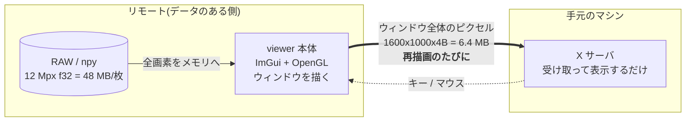
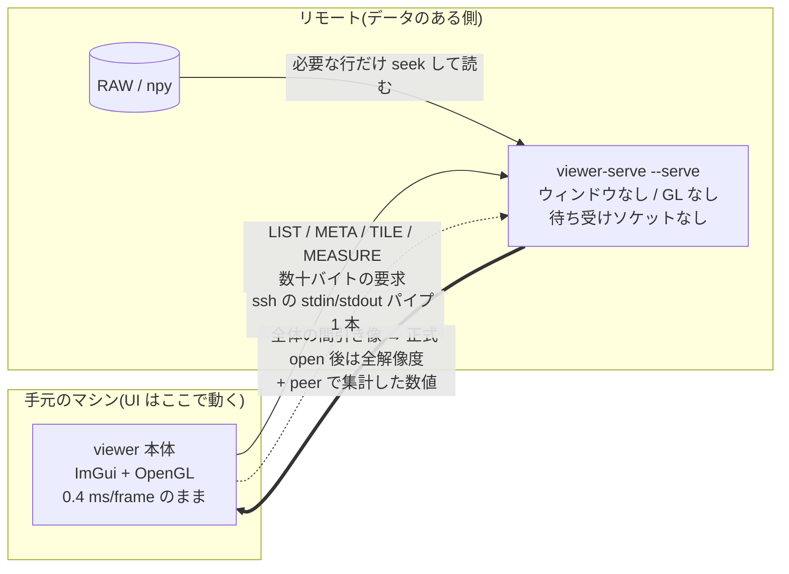

# リモートのデータを手元から見る (`ssh://`)

計算機に置いた大量の画像・配列を、手元のマシンの viewer から開いて測るための仕組みです。
稼働中の機能です(プロトコル `VERSION = 14`、
[core/remote_proto.h](../../../core/remote_proto.h) /
[core/serve.cpp](../../../core/serve.cpp) / [core/remote.cpp](../../../core/remote.cpp))。
現在の対応範囲は `.npy`、PNG、JPEG、TIFF、単一 document の OpenEXR、y4m、
レシピ付きのヘッダ無し RAW、`.npz` のメンバ、および peer 上で実行する Reader です。
複数の named layer を持つ OpenEXR は、現行 wire がファイル内の layer を指せないため
リモートでは名指しで拒否します。
残っている制限は §8。

---

## 1. いま何が遅いのか — 「送る単位」の問題

この viewer は**即時モード UI**(Dear ImGui)です。パネルの状態を保持したウィジェット
ツリーは持たず、毎フレーム全パネルの描画関数を走らせて、**ウィンドウ全体**を OpenGL で
描き直し、`SwapBuffers` で画面に出します。ローカルでは 1 フレーム **0.4 ms**
(`viewer --bench` の実測: median 0.27 ms / p95 0.50 ms)。GPU に描いたものが
そのまま目の前のディスプレイに出るので、全画面描き直しでもコストはゼロに近い。

`ssh -X`(X11 転送)にすると、この「全画面描き直し」がそのままネットワークに出ます。
1600x1000 のウィンドウ = 1.6 Mpx x 4 B = **6.4 MB を再描画のたびに転送**。実測で
**500 ms/frame、入力遅延 300 ms**。文字を打っても 0.3 秒後に出る状態です。

Qt のような**保持モード**の 2D ツールキットは違います。ウィジェットツリーを保持している
ので、テキストボックスに 1 文字打ったときに「変化したのはこの矩形だけ」と分かる。
X11 に出るのはその矩形の描画コマンドだけ、**約 20 KB**。

| | 即時モード + OpenGL (この viewer) | 保持モード 2D (Qt など) |
|---|---|---|
| 描画の単位 | ウィンドウ全体を毎フレーム再構築 | 変化したウィジェットの矩形だけ |
| X11 に出るもの | フレームバッファのピクセル | 差分矩形の描画コマンド |
| 文字入力 1 回の転送量 | **6.4 MB** (1600x1000x4B) | **約 20 KB** |
| 比 | **約 320 倍** | 1 |
| 実測の体感 | 500 ms/frame、入力遅延 300 ms | 即時 |
| ローカルでの速度 | 0.4 ms/frame | 同等かそれ以下 |

**この 300 倍はツールキットの優劣ではありません。**「送る単位がウィンドウ全体か、変化した
矩形か」の違いです。ローカルでは即時モードのほうが速い(状態同期のコストがない)。
X11 という「ピクセルを転送する経路」に載せた瞬間だけ、単位の大きさが効いてくる。

6.4 MB を 500 ms ということは、実効スループットは約 13 MB/s ≒ 100 Mbps 級の回線を
使い切っている計算です(概算)。回線を太くしても、単位が 6.4 MB のままなら
1 Gbps でも 50 ms/frame = 20 fps 相当にしかなりません。**単位を変えないと直らない。**



> 参考: [ARCHITECTURE.md 「フレームループと描画」](../../../ARCHITECTURE.md#4-フレームループと描画)
> の不変条件 4「アイドル時は描画しない」と「再描画ポリシー」節は、まさにこの
> 「1 フレーム = 画面全体の転送」を前提にした縛りです。`wakeUi()` を毎フレーム呼ぶ経路を
> 作ると、X11 越しでは 6.4 MB/frame を延々と流し続けることになります。

---

## 2. 現行設計 — GUI を転送せず、最初の表示と完全な画素を分ける

**転送するのは画素と数値だけ。GUI は転送しない。**

- **UI は手元のマシンで動く。** ネイティブ実行(Windows / Linux / macOS)は本ツールの
  必須要件で、そこは変えません。ローカルの 0.4 ms/frame をそのまま維持します。
- **リモートでは headless の `viewer-serve --serve` が動く。**
  ウィンドウを作らず、OpenGL を初期化せず、ソケットも開かない。stdin から要求を読んで
  stdout に返事を書くだけのプロセスです。GUI 本体の `viewer --serve` も検証用に同じ
  protocol を話しますが、自動導入されるのは standalone の `viewer-serve` です。
- 最初はフレーム全体を `max(w,h) <= 1600` になる `step` で間引いて取り、先に表示します。
  正式 open なら、その後に**フレーム全体の全解像度 TILE**を別の ssh session で取得し、
  到着時に間引き像と置き換えます。Browse の使い捨て preview も、元のフレームが
  48 MiB 以下なら低優先度で全解像度を先読みします。
- stack の残りの frame はメモリ予算に収まる分をバックグラウンド取得します。
  全画素が要らない時間統計・ROI 統計は `MSG_MEASURE` で peer 側に計算させ、数値だけ返せます。



要点は 2 つ。**(1) 最初の表示は間引いて待ち時間を短くする**、
**(2) 解析は可能ならデータのある側で行い、画素列ではなく数値を返す**。
現在の client は viewport ごとの部分 TILE をパンのたびに要求する方式ではありません。
正式 open した 1 frame は最終的に全画素を手元へ置きます。文字入力・ROI のドラッグ・
メニュー操作そのものは追加要求を出しませんが、先に open した全解像度 fetch が
バックグラウンドで続いていることはあります。

---

## 3. なぜ ssh の標準入出力なのか

手元の viewer が

```
ssh -o BatchMode=yes user@host ~/.viewer/viewer-serve --serve --serve-readers
```

を起動し、**その子プロセスの stdin/stdout と会話する**だけです
([core/remote.cpp](../../../core/remote.cpp) の `Session::start`)。
rsync も git も同じ方式で動いています(`rsync --server`, `git-upload-pack`)。

| 利点 | 中身 |
|---|---|
| **ポート開放が要らない** | 使うのは既に開いている ssh の 22 番だけ。ファイアウォール申請ゼロ |
| **デーモン常駐が要らない** | プロセスは接続中だけ生きる。viewer を閉じればパイプが閉じ、`readExact` が 0 を返して自然終了 |
| **待ち受けソケットが存在しない** | サーバは `bind`/`listen` を一切しない。**攻撃面がない** — ssh を通っていない人はそもそも到達経路を持たない |
| **認証は ssh が済ませている** | 独自の資格情報・トークン・TLS 証明書を持たない。鍵の運用は既存のまま |
| **設定ファイルもトンネルも不要** | `~/.ssh/config` の Host エイリアスがそのまま使える。ProxyJump や踏み台も追加実装なしで利用できる |
| **peer は 1 実行ファイル** | リモートに置くアプリは headless の `viewer-serve`。native 形式を読むだけなら Python は不要で、Reader を使う場合は peer 側に Python + numpy が要る |

`-o BatchMode=yes` を付けているので、**公開鍵認証(または ssh-agent / ControlMaster)が
前提**です。パスワード入力を求められる接続は、GUI 側に打ち込む端末がないため
即座に失敗させます(ハングするより速く原因が分かる)。

---

## 4. 何がネットワークを流れるのか

プロトコルは [core/remote_proto.h](../../../core/remote_proto.h) で定義しています。フレーミングは
`[magic][type][len][payload]` の 12 バイトヘッダのみ。HELLO の後に使う要求は
8 種類です。

| メッセージ | 要求 | 返答 | 典型サイズ |
|---|---|---|---|
| `MSG_LIST` | パス | ディレクトリ項目(名前 / dir / サイズ / mtime / npy ヘッダの形状・dtype、連番は 1 グループ行に集約) | 数百 B 〜 数十 KB |
| `MSG_META` | パス | `w, h, ch, dtype, frames` | **基本 24 バイト** + 宣言 shape 等の optional trailer |
| `MSG_TILE` | パス + frame + 矩形 + `step` | 間引き済み画素(**元の dtype のまま**) | 下記 |
| `MSG_MEASURE` | パス + ROI + アナライザ名 | 測定結果の数値 | 数十バイト〜数十 KB |
| `MSG_GLOB` | ルート + パターン + 深さ/件数上限 | 一致した相対パス(打ち切りフラグ付き) | 数 KB |
| `MSG_SCAN` | ルート + 深さ/件数上限 | サブフォルダごとのスタック一覧(リモート版 Open Folder) | 数 KB |
| `MSG_READER_RUN` | 元パス + Reader/harness のテキスト | 実行結果、provenance、materialisation の鍵と木 | ヘッダと結果に依存 |
| `MSG_NPZ_SCAN` | `.npz` のパス | メンバ名、npy ヘッダ、小さい補助配列、materialisation の鍵 | メンバ数に依存 |

LIST の拡張・GLOB・SCAN はプロトコル 3。相手が 2 のときはサーバが v2 形式で
LIST を返し、クライアントは形状・日時列を「-」表示にしてブラウズ自体は続く。

Browse パネルの表示モードと通信量の関係:

| 操作 | 追加の往復 |
|---|---|
| grouped ⇄ flat(連番の展開) | **0**。`.members` は最初の LIST に必ず入っている |
| tree でノードを展開 | そのノードの `MSG_LIST` **1 回だけ**(ワーカースレッド) |
| tree でノードを畳む | 0。子はキャッシュに残り、開き直しても 0 |
| refresh / 別ホストへ接続 | キャッシュ破棄(次の展開で再取得) |

### TILE の `step` — 先に間引き像、後から完全な frame

`TileReq` の `step` はサンプル間引きの刻みです。現行 client の初回要求は viewport の
矩形ではなく**フレーム全体**で、`step = ceil(max(w,h) / 1600)`。正式 open では同じ
フレーム全体を `step = 1` でバックグラウンド取得し、最初の間引き像と置き換えます。

**ケース A: 4000x3000 の f32 画像を初めて表示**

| | 値 |
|---|---|
| 元データ | 4000x3000 = 12 Mpx、f32 → ファイル上 48 MB |
| 初回の規則 | `ceil(max(4000,3000) / 1600)` → `step = 3` |
| 最初に送るサンプル数 | 1334 x 1000 = **1.334 Mpx**(12 Mpx ではない) |
| 最初の生バイト数 | 1.334 Mpx x 4 B = **約 5.3 MB** |
| deflate 後 | **概算 2〜4 MB**(センサデータの圧縮率次第。クライアントは常に圧縮を要求) |
| 最初のリモート側ディスク読み | **概算 16 MB**(1000 行 x 4000 px x 4 B。`.npy` 等の場合) |
| 正式 open 後 | 全体を `step = 1` で取得。生 48 MB (deflate 後はデータ依存) |

**ケース B: Browse の使い捨て preview**

| | 値 |
|---|---|
| 最初の表示 | ケース A と同じ、全体を `step = 3` で取得 |
| 元フレームが 48 MiB 以下 | 低優先度で全体の `step = 1` fetch も開始 |
| 48 MiB を超える | preview の間は間引き像のまま。正式 open への昇格時に全解像度 fetch |

したがって `step` が抑えるのは**最初の表示までの転送量**です。正式 open した frame の
総転送量は画像サイズに比例し、最終的には全解像度が手元に来ます。プロトコル自体は矩形を
指定できますが、現行 client はパン／ズームごとの viewport TILE には使っていません。

### 送らないとき

| 操作 | 流れるもの |
|---|---|
| 文字入力(ファイル名フィルタ、数値入力) | 追加要求 0 |
| ROI のドラッグ・リサイズ | 追加要求 0。peer 集計を実行したときだけ `MSG_MEASURE` |
| メニュー・パネル配置・テーマ変更 | **0 バイト** |
| 黒点/白点・ガンマ・カラーマップ変更 | **0 バイト**(表示変換は手元の画素に対して行う) |
| パン / ズーム(視野が変わった) | 追加要求 0。現在の frame 全体を resident にする設計 |
| フレーム送り(`←→`) | resident なら 0。未取得 frame は全体の TILE をバックグラウンド取得 |

ここでの 0 は**その操作が新しい要求を作らない**という意味です。open によって既に始まった
全解像度 fetch は並行して流れ続けます。X11 転送では UI の再描画自体が毎回ネットワークへ
出るため、この違いは残ります。

### `.npy` / ヘッダ無し RAW はディスクからも必要分だけ読む

[core/serve.cpp](../../../core/serve.cpp) の `readNpyRegion()` は、フレームをメモリに載せません。
要求された行だけを `seekg` で拾い、**読みながら間引きます**。

```cpp
for (uint32_t y = y0, oy = 0; oy < outH; y += step, oy++) {
    n.f.seekg((std::streamoff)(base + ((uint64_t)y * n.w + x0) * px));
    n.f.read((char*)row.data(), (std::streamsize)row.size());
    ...
}
```

`y += step` なので、`step = 3` なら**3 行につき 1 行だけを読む**。48 MB の配列に
対するディスク I/O は概算 16 MB で済み、ページキャッシュも汚しません
(`NpyFile` の設計方針コメント: 「A reader, not a loader」)。
`n.bigEndian` のバイトスワップもサーバ側で済ませるので、手元は素直に読めます。

この部分読みの性質は、最初の `step > 1` 要求では `.npy`、レシピ付きヘッダ無し RAW、
peer cache に materialise された `.npz` member / Reader 出力に適用されます。
正式 open 後の `step = 1` fetch は frame 全体を読みます。PNG / JPEG / TIFF / OpenEXR / y4m は
各 decoder が peer 側でファイルを復号してから、要求された矩形と step だけを TILE として
返します。最初にリンクを流れる量は間引かれますが、codec のディスク I/O は部分読みとは
限らず、正式 open の完了時には全解像度 frame がリンクを渡ります。

### MEASURE — 解析はデータのある側で

`MSG_MEASURE` は「ROI とアナライザ名を送り、**数値だけ**返す」ための予約枠です。
PRNU も e-SFR もノイズフロアも、入力は数 Mpx あっても出力は
`mean=512.3, std=4.71, MTF50=0.31` のような**数十バイト**。
全画素を手元へ転送してから測るのは非効率です。
解析プラグインをリモート側で実行し、結果だけを返す方式が適しています。

set 解析(DSNU / PRNU / 分離フィット)も同じ方式で実装済みです。ただし set の入力は
**役割の付いた N 本の stack** なので、`MeasureReqHead` の平坦なパス列では
「どこで1本が終わるか」を書けません。`MOP_SET_FOLD` は rois の後ろに
**役割ブロック**を足してそれを言い、返すのは平面ごとの和だけ — 名前のある量は
どれも手元で合成されます。480 枚の dark は peer 側で集計され、リンクを渡るのは
スカラです。

---

## 5. 当初の「WebSocket ブリッジ」との関係

初期ロードマップにあった「WebSocket ブリッジ(ブラウザをリモートフロントエンドに)」は、
**この設計と別物ではありません。転送方式だけが異なります。**

[core/serve.cpp](../../../core/serve.cpp) は最初からそう作ってあります。
ハンドラ(`handleList` / `handleMeta` / `handleTile`)は、要求がどこから来て返事がどこへ
行くのかを**知りません**。返事は `ReplySink` という関数ポインタに渡すだけです。

```cpp
using ReplySink = bool (*)(uint32_t type, const Buf& payload);
static ReplySink g_sink = nullptr;
...
void handleRequest(uint32_t type, Buf& in) { ... }   // transport 非依存
```

`runServeMode()` が `g_sink = sendStdio;` を差すのが今の ssh 版。
WebSocket 版は `g_sink` に別の関数を差して `handleRequest` を呼ぶだけで、
**ハンドラも `readRegion()` も `remote_proto.h` も 1 行も変えずに**ブラウザ対応になります。

| | いま: ssh stdio | 将来: WebSocket ブリッジ |
|---|---|---|
| **転送路** | ssh が張った stdin/stdout パイプ 1 本 | TCP / WSS(HTTP アップグレード) |
| **クライアント** | viewer 本体(ネイティブ、手元で動く) | ブラウザ(Web フロントエンド) |
| **サーバ側の仕事** | `handleRequest` + `ReplySink = sendStdio` | **同じ `handleRequest`** + `ReplySink = sendWs` |
| **フレーミング** | 12 B ヘッダ + payload | WebSocket バイナリフレームに同じ payload |
| **認証** | ssh(既存の鍵運用のまま) | 別途必要(TLS + トークン等) |
| **待ち受けソケット** | **なし** | 必要(= 守る対象が増える) |
| **導入の手間** | リモートに headless の `viewer-serve` を置くだけ | サーバ常駐・証明書・ポート開放 |

ssh 版を先に作るのは、**同じ内部設計で、新しい待ち受けポートや常駐プロセスを
必要としない経路を先に実現できる**からです。
WebSocket は「ブラウザから見たい」という要求が実際に出たときに、この上に足します。

---

## 6. 他の選択肢との比較

前提: 12 Mpx f32(48 MB/枚)の連番 300 枚 = 14 GB がリモートにある。
ウィンドウは 1600x1000。

| 方式 | ネットワークを流れるもの | 速度 | 準備の手間 |
|---|---|---|---|
| **(a) `ssh -X` のまま** | **ウィンドウ全体のピクセル 6.4 MB を再描画のたびに** | **500 ms/frame、入力遅延 300 ms**(実測) | 不要。ただし遅さは構造的で、設定で直らない |
| **(b) xpra** | ウィンドウ全体を**符号化 + 差分**して送る。単位は (a) と同じ「ウィンドウ全体」だが、H.264/VP8 と差分矩形で **1〜2 桁減**(概算 数十〜数百 KB/frame) | 操作は実用域に入る。ただし**非可逆符号化で画素値が変わりうる**——画質評価では致命的 | 両側に xpra を導入、セッション管理(`xpra start/attach`)、常駐プロセスあり |
| **(c) sshfs でマウントしてローカル実行** | **ファイル丸ごと**。1 枚開くたび **48 MB**、連番 300 枚を走査すると **14 GB** | 1 枚目の表示までに 48 MB 待ち。連番の一括ロード・フォルダ走査で全読みが走る | FUSE / sshfs の導入(macOS は特に面倒)、マウント権限、切断時のハング対策 |
| **(d) 本方式 (`ssh://`)** | 最初は**フレーム全体の間引き像**(ケース A: deflate 後 概算 2〜4 MB)。正式 open 後は全解像度 frame、peer 集計では数値だけ | UI は手元で 0.4 ms/frame。最初の間引き像を先に表示し、完全な frame は背景取得 | リモートに headless の `viewer-serve` を置くだけ。ポート・デーモン・設定ファイルなし |

補足:

- **(c) sshfs の本質的な問題**は、最初の間引き像や peer 集計だけが欲しい場面でも、
  ファイルシステム層は画像の geometry や測定 op を知らないこと。正式 open 後の全解像度
  frame 転送は本方式にもありますが、初期表示と server-side MEASURE を分けられる点が違います。
- **(b) xpra は「送る単位」を変えていない**。ウィンドウ全体を送るのは同じで、符号化と差分で
  絞っているだけです。そのため、転送量と画素値の信頼性がトレードオフになります。
  画素値をそのまま読みたい viewer には適さない。
- **(d) は UI の再描画ではなく、データ要求を送ります。** 最初の表示は `step` で間引き、
  正式 open 後は全解像度 frame を resident にするので、「総転送量が常に画面サイズで
  頭打ち」という方式ではありません。一方、`MSG_MEASURE` は画素全体ではなく集計値だけを
  返します。`TileRep.dtype` は元の dtype なので、**届いたサンプル値は厳密**です
  (u16 は u16 のまま、f32 は f32 のまま)。

---

## 7. 使い方

```bash
viewer ssh://user@host/data/run42
```

これだけ。内部では
`ssh -o BatchMode=yes -o ConnectTimeout=10 user@host ~/.viewer/viewer-serve --serve --serve-readers`
が起動し、`/data/run42` を LIST します(`remote.cpp` `Session::start`)。

- リモート側の準備は**`~/.viewer/viewer-serve` があること**だけ。無ければ初回接続時に
  自動導入します。まず手元の配布物またはビルドツリーにある対象 OS 用
  `viewer-serve` を ssh 越しに送り、見つからない／送れない場合だけサーバ側の
  git + network で `binaries` ブランチを取得します。`--remote-exe <path>` で
  明示指定もできます。
- `~/.ssh/config` の Host エイリアスがそのまま使えます(`ssh://dev-box/data/run42`)。
- 既存のローカル起動は一切変わりません。パスがローカルなら従来通りローカルで読みます。

デバッグ用に、ホストを空にするとローカルで `viewer --serve --serve-readers` を起動して同じ経路を通します
(`Session::start` の `host.empty()` 分岐)。プロトコルの検証はネットワークなしでできます。

---

## 8. 制限と今後

現時点(プロトコル `VERSION = 14`、
[core/remote_proto.h](../../../core/remote_proto.h))の状態。
**残っている制限だけ**を書く節です。実装済みの項目を、未実装であるかのように
残さないでください。この節には過去にその誤記がありました。

| 項目 | 状態 |
|---|---|
| **対応フォーマット** | `.npy`、PNG、JPEG、TIFF、単一 document の OpenEXR、y4m。複数 named layer の OpenEXR は現行 wire が layer を指せず、誤って先頭だけを返さないため拒否する。ヘッダ無し RAW (`.bin .raw .yuv .dat .rggb`) は宣言したレシピを protocol 11 のトレーラで運ぶ。`.npz` は protocol 13 の `MSG_NPZ_SCAN` でメンバを列挙し、選んだメンバを既存の META/TILE 経路で読む。ベンダ RAW だけは LibRaw の配布条件により native peer では読まず、理由とローカル／Reader という代替手段を表示する |
| **`read as` / `re-read as…`** | **実装済み**([input-adapters.md](../adapters/input-adapters.md) §3.3、protocol 9、issue #124)。META が**ファイルが宣言した shape** を運び(`MR_SHAPE` で本体の後ろに `[u32 ndim][u32 dims[4]]`)、META と TILE が**宣言された読み方**(`rp::NpyRead`)を受ける。peer 側は `serveLayout` が軸割り当てとストライドをやり直すので、`(48,40,1)` を `(F,H,W)` として読み直した TILE が**ローカルの読み直しと1画素も違わない**。古い peer は末尾を読まないため、client が HELLO の数から**送る前に断る** |
| **ヘッダ無し RAW** | **実装済み**(protocol 11)。手元で指定したレシピ(画素フォーマット × 解釈 × 寸法)を META/TILE/MEASURE の各要求に載せ、peer が宣言どおりに読む。1クリック preview は幾何が未宣言なので行わず、正式に開くときにレシピを選ぶ |
| **`.npz`** | **実装済み**(protocol 13)。peer はメンバの事実を列挙し、分類と picker は client のローカル経路と同じものを使う。単一 image member は picker 無しで開く。コンテナ自体には単一 geometry がないため、Browse の1クリック preview は行わない |
| **Reader** | **stage 0〜5 実装済み**(protocol 12〜14)。Reader はファイルのある peer で走り、META/TILE と鍵付き MEASURE は materialisation の同じ生成物を参照する。鍵付き subject で現在走るのは temporal / frame ROI stats の2 op。人が読む source 名を欠く plugin analyzer / set fold と、Ref の名前空間を束縛できない set-bearing Reader の返り値は名指しで拒否する。実行には peer の `--serve-readers` が必要で、通常の viewer の ssh/local session はこのフラグを付けて起動する。standalone peer 自体の既定は閉 |
| **Fortran order の .npy** | **対応済み**。`NpyFile` が軸ごとの要素ストライド(`sFrame`/`sY`/`sX`/`sCh`)を持ち、C order と同じ経路で読む |
| **`MSG_MEASURE`** | **実装済み**(`serve.cpp` `handleMeasure`)。`MOP_TEMPORAL_STATS` と `MOP_FRAME_ROI_STATS` がサーバ側で走り、結果だけが返る。タイルを引いて手元で測るのは `--remote-policy local-fetch` の経路 |
| **`MOP_PLUGIN_ANALYZE`** | **実装済み**([abi-v3.md](../../reference/abi-v3.md) §10、protocol 7)。プラグインの **name + version が等値** のときだけ peer で走る。不一致は**両方の版を並べて拒否**し、黙って手元実行に振り替えない。frame / stack の両方に届き、返答は peer 自身の記録を provenance として運ぶ |
| **`MOP_SET_FOLD`** | **実装済み**([analysis-layers.md](../../analysis-layers.md) §3.5 / §6、protocol 8)。set 解析の畳み込みは peer で走り、DSNU / PRNU / 分離フィットという名前のある量は client で合成する。返るのは役割ごと平面ごとの集約値で、画素列そのものは渡さない |
| **先読み(prefetch)** | 実装済み(`rfWorker`)。最初の全体間引き像の後、正式 open した frame を `step = 1` で全体取得する。frame 軸／連番の残りもメモリ予算内で取得する。`Session` は**スレッドセーフではない**ので、**1 つの `Session` には所有スレッドが 1 つだけ**という規律で回す(下の所有表)。共有して mutex で守るのは誤り — 片側しか取らない mutex は何も守らないし、両側が取れば片方のネットワーク I/O の間じゅう他方が止まる |
| **`ssh://` の CLI 配線** | **配線済み**。`openPath` が `ssh://` と `local://` を受け、`viewer ssh://host/path.npy`(ファイル)と `viewer ssh://host/~/dir`(接続してそこを Browse)の両方が起動パス。`--help` にも出る |
| **LIST のファイルサイズ** | 64 bit。u32 の lo/hi 2 本で送る(`serve.cpp`、`remote_proto.h` の mtime と同じ形) |
| **圧縮** | deflate(miniz)固定、level 6。クライアントは常に要求し、縮まなかったときだけ生で返る |
| **並列・キャンセル** | 1 session 内ではなし。1 要求 1 返答の同期往復。用途ごとに session を分けて並行させるが、`rp::Header` に要求 ID が無いため、送信済みの古い full-fetch 等を応答単位で捨てる protocol cancellation は無い(下の所有表がその帰結) |

### `Session` の所有規則

`rp::Header` には**要求 ID が無い**。`Session::recv` は「次に届いたヘッダ」を
そのまま消費するので、2 スレッドが 1 本の ssh の stdin にフレームを書けば
返答が食い違い、ストリームは**恒久的に**ずれる。加えて `stop()` は `Pipe` を
`delete` するので、読んでいる最中の相手は use-after-free になる。
したがって **1 `Session` = 1 所有スレッド**:

| Session | 所有者 | 用途 |
|---|---|---|
| `app.rbSession` | `rbWorker` | CONNECT / LIST / SCAN / GLOB / 木の展開 / 切断 |
| `app.uiSession` | UI スレッド | `openRemote` の META + TILE(プレビューと最初の 1 枚) |
| `rfWorker` のローカル `Session` | `rfWorker` | 全解像度 TILE の先読み |
| `mWorker` のローカル `Session` | `mWorker` | MEASURE(サーバ側集計) |

所有者以外は `Session` に**触れない**。UI が必要とする値(`peerVersion` /
`bytesReceived` / 生死)は所有スレッドが `RbResult` に載せて返し、UI は
`App::RemoteBrowse` の**ただの値**を読む。ホストあたり ssh チャネルは
最大 4 本になるが、これは競合と UI フリーズの両方を同時に消す唯一の形。

**次にやること**(優先順)。上の表で「実装済み」のものはここに書かない:

1. 古い要求のキャンセル。まず `rp::Header` に要求 ID を足す(VERSION を上げる)ところから。
   これが無いうちは 1 session 内の多重化もできない
2. WebSocket transport(`ReplySink` を差し替えるだけ。§5 参照)

---

## 関連

- [core/remote_proto.h](../../../core/remote_proto.h) — ワイヤフォーマットの定義
- [core/serve.cpp](../../../core/serve.cpp) — `viewer-serve`。要求処理と間引き読みの本体
- [core/remote.cpp](../../../core/remote.cpp) — 手元側の `Session`
- [ARCHITECTURE.md 「フレームループと描画」](../../../ARCHITECTURE.md#4-フレームループと描画) —
  毎フレーム処理の不変条件と再描画ポリシー。`View > Low bandwidth` もここ
- [README リモート](../../../README.md#リモート-ssh) — 利用者向けの案内
