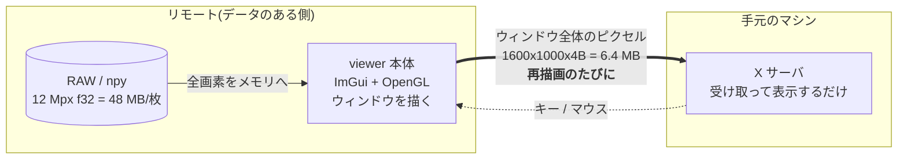
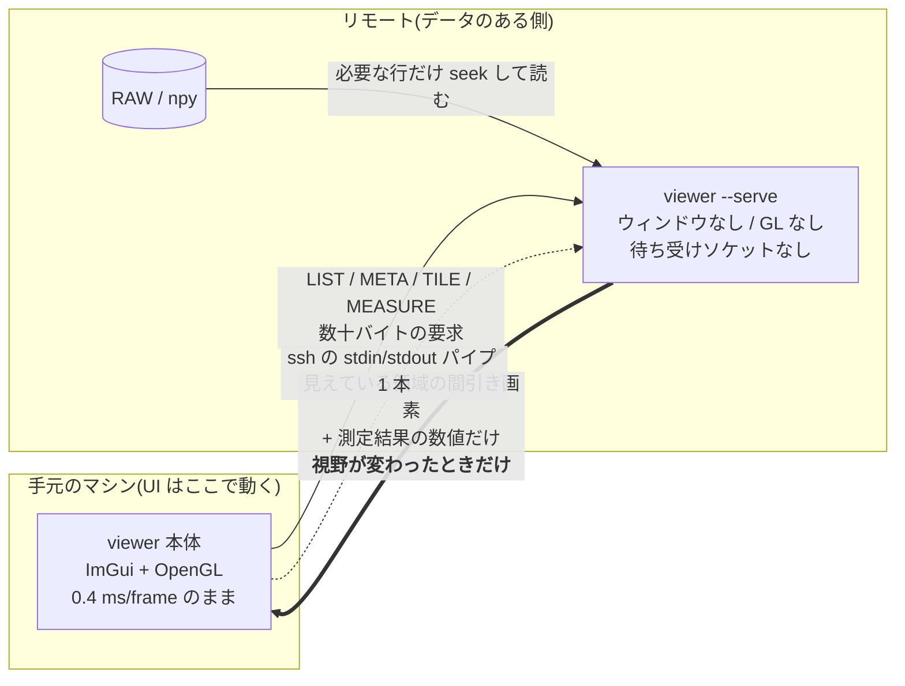

# リモートのデータを手元から見る (`ssh://`)

計算機に置いた大量の RAW/npy を、手元のマシンの viewer から開いて測るための仕組み。
稼働中の機能です(プロトコル `VERSION = 9`、[core/remote_proto.h](../../../core/remote_proto.h) /
[core/serve.cpp](../../../core/serve.cpp) / [core/remote.cpp](../../../core/remote.cpp))。
残っている制限は §8。

---

## 1. いま何が遅いのか — 「送る単位」の問題

この viewer は**即時モード UI**(Dear ImGui)です。パネルの状態を保持したウィジェット
ツリーは持たず、毎フレーム全パネルの描画関数を走らせて、**ウィンドウ全体**を OpenGL で
描き直し、`SwapBuffers` で画面に出します。ローカルでは 1 フレーム **0.4 ms**
(`viewer --bench` の実測: median 0.27 ms / p95 0.50 ms)。GPU に描いたものが
そのまま目の前のディスプレイに出るので、全画面描き直しでもコストはゼロに近い。

`ssh -X`(X11 転送)にすると、この「全画面描き直し」がそのままネットワークに出ます。
1600x1000 のウィンドウ = 1.6 Mpx x 4 B = **6.4 MB を再描画のたびに転送**。実測で
**500 ms/frame、入力遅延 300 ms**。文字を打っても 0.3 秒後に出る状態です。

Qt のような**保持モード**の 2D ツールキットは違います。ウィジェットツリーを保持している
ので、テキストボックスに 1 文字打ったときに「変化したのはこの矩形だけ」と分かる。
X11 に出るのはその矩形の描画コマンドだけ、**約 20 KB**。

| | 即時モード + OpenGL (この viewer) | 保持モード 2D (Qt など) |
|---|---|---|
| 描画の単位 | ウィンドウ全体を毎フレーム再構築 | 変化したウィジェットの矩形だけ |
| X11 に出るもの | フレームバッファのピクセル | 差分矩形の描画コマンド |
| 文字入力 1 回の転送量 | **6.4 MB** (1600x1000x4B) | **約 20 KB** |
| 比 | **約 320 倍** | 1 |
| 実測の体感 | 500 ms/frame、入力遅延 300 ms | 即時 |
| ローカルでの速度 | 0.4 ms/frame | 同等かそれ以下 |

**この 300 倍はツールキットの優劣ではありません。**「送る単位がウィンドウ全体か、変化した
矩形か」の違いです。ローカルでは即時モードのほうが速い(状態同期のコストがない)。
X11 という「ピクセルを転送する経路」に載せた瞬間だけ、単位の大きさが効いてくる。

6.4 MB を 500 ms ということは、実効スループット 約 13 MB/s ≒ 100 Mbps 級の回線を
使い切っている計算です(概算)。回線を太くしても、単位が 6.4 MB のままなら
1 Gbps でも 50 ms/frame = 20 fps 相当にしかなりません。**単位を変えないと直らない。**



> 参考: [ARCHITECTURE.md 「性能の建付け」](../../../ARCHITECTURE.md#性能の建付け-計測してから議論する)
> の不変条件 4「アイドル時は描画しない」と「再描画ポリシー」節は、まさにこの
> 「1 フレーム = 画面全体の転送」を前提にした縛りです。`wakeUi()` を毎フレーム呼ぶ経路を
> 作ると、X11 越しでは 6.4 MB/frame を延々と流し続けることになります。

---

## 2. 新しい設計 — GUI を転送するのをやめる

**転送するのは画素と数値だけ。GUI は転送しない。**

- **UI は手元のマシンで動く。** ネイティブ実行(Windows / Linux / macOS)は本ツールの
  必須要件で、そこは変えません。ローカルの 0.4 ms/frame をそのまま維持します。
- **リモートには同じバイナリを `--serve` で起動したものが待つ。**
  ウィンドウを作らず、OpenGL を初期化せず、ソケットも開かない。stdin から要求を読んで
  stdout に返事を書くだけのプロセスです。
- 手元の viewer は「ファイルを読む」代わりに「見えている領域を要求する」。
  画面に出る画素の分だけが線を通ります。



肝は 2 つ。**(1) 送るのは画面に映る分だけ**(12 Mpx ではなく 1.3 Mpx)、
**(2) 送るのは視野が変わったときだけ**(毎フレームではない)。
文字入力・ROI のドラッグ・メニュー操作では、**画素は 1 バイトも流れません**。

---

## 3. なぜ ssh の標準入出力なのか

手元の viewer が

```
ssh -o BatchMode=yes user@host viewer --serve
```

を起動し、**その子プロセスの stdin/stdout と会話する**だけです
([core/remote.cpp](../../../core/remote.cpp) の `Session::start`)。
rsync も git も同じ方式で動いています(`rsync --server`, `git-upload-pack`)。

| 利点 | 中身 |
|---|---|
| **ポート開放が要らない** | 使うのは既に開いている ssh の 22 番だけ。ファイアウォール申請ゼロ |
| **デーモン常駐が要らない** | プロセスは接続中だけ生きる。viewer を閉じればパイプが閉じ、`readExact` が 0 を返して自然終了 |
| **待ち受けソケットが存在しない** | サーバは `bind`/`listen` を一切しない。**攻撃面がない** — ssh を通っていない人はそもそも到達経路を持たない |
| **認証は ssh が済ませている** | 独自の資格情報・トークン・TLS 証明書を持たない。鍵の運用は既存のまま |
| **設定ファイルもトンネルも不要** | `~/.ssh/config` の Host エイリアスがそのまま使える。ProxyJump も踏み台もタダで乗る |
| **バイナリ 1 個** | リモートに置くのは同じ `viewer` 実行ファイル。Python 環境もライブラリも要らない |

`-o BatchMode=yes` を付けているので、**公開鍵認証(または ssh-agent / ControlMaster)が
前提**です。パスワード入力を求められる接続は、GUI 側に打ち込む端末がないため
即座に失敗させます(ハングするより速く原因が分かる)。

---

## 4. 何がネットワークを流れるのか

プロトコルは [core/remote_proto.h](../../../core/remote_proto.h)。フレーミングは
`[magic][type][len][payload]` の 12 バイトヘッダのみ。要求は 6 種類です。

| メッセージ | 要求 | 返答 | 典型サイズ |
|---|---|---|---|
| `MSG_LIST` | パス | ディレクトリ項目(名前 / dir / サイズ / mtime / npy ヘッダの形状・dtype、連番は 1 グループ行に集約) | 数百 B 〜 数十 KB |
| `MSG_META` | パス | `w, h, ch, dtype, frames` | **24 バイト** |
| `MSG_TILE` | パス + frame + 矩形 + `step` | 間引き済み画素(**元の dtype のまま**) | 下記 |
| `MSG_MEASURE` | パス + ROI + アナライザ名 | 測定結果の数値 | 数十バイト〜数十 KB |
| `MSG_GLOB` | ルート + パターン + 深さ/件数上限 | 一致した相対パス(打ち切りフラグ付き) | 数 KB |
| `MSG_SCAN` | ルート + 深さ/件数上限 | サブフォルダごとのスタック一覧(リモート版 Open Folder) | 数 KB |

LIST の拡張・GLOB・SCAN はプロトコル 3。相手が 2 のときはサーバが v2 形式で
LIST を返し、クライアントは形状・日時列を「-」表示にしてブラウズ自体は続く。

Browse パネルの表示モードと通信量の関係:

| 操作 | 追加の往復 |
|---|---|
| grouped ⇄ flat(連番の展開) | **0**。`.members` は最初の LIST に必ず入っている |
| tree でノードを展開 | そのノードの `MSG_LIST` **1 回だけ**(ワーカースレッド) |
| tree でノードを畳む | 0。子はキャッシュに残り、開き直しても 0 |
| refresh / 別ホストへ接続 | キャッシュ破棄(次の展開で再取得) |

### TILE の `step` が肝

`TileReq` の `step` はサンプル間引きの刻みです。**「画面で見えている解像度以上は送らない」**
という一点だけで、転送量が桁で変わります。

**ケース A: 4000x3000 の f32 画像を 1000 px のペインにフィット表示**

| | 値 |
|---|---|
| 元データ | 4000x3000 = 12 Mpx、f32 → ファイル上 48 MB |
| ペイン高さ | 1000 px → `step = 3` |
| 実際に送るサンプル数 | 1333 x 1000 = **1.33 Mpx**(12 Mpx ではない) |
| 生バイト数 | 1.33 Mpx x 4 B = **5.3 MB** |
| deflate 後 | **概算 2〜4 MB**(センサデータの圧縮率次第。クライアントは常に圧縮を要求) |
| リモート側がディスクから読む量 | **概算 16 MB**(1000 行 x 4000 px x 4 B。48 MB 全部は読まない) |
| 送るタイミング | **この 1 回だけ**。以後どれだけ操作しても再送なし |

**ケース B: 等倍(1:1)で一部を拡大**

| | 値 |
|---|---|
| 見えている矩形 | 例 1000 x 700 px、`step = 1` |
| 送るサンプル数 | 0.7 Mpx → 生 **2.8 MB**、deflate 後 概算 1〜2 MB |
| ディスク読み | 700 行 x 1000 px x 4 B = **2.8 MB** |

`step` は「そもそも見えない情報を送らない」ための仕掛けなので、
**画像が大きくなっても転送量はペインの大きさで頭打ち**になります。
12 Mpx でも 50 Mpx でも、1000 px のペインに映る限りコストはほぼ同じ。

### 送らないとき

| 操作 | 流れるもの |
|---|---|
| 文字入力(ファイル名フィルタ、数値入力) | **0 バイト** |
| ROI のドラッグ・リサイズ | **0 バイト**(統計は手元にあるタイルから計算) |
| メニュー・パネル配置・テーマ変更 | **0 バイト** |
| 黒点/白点・ガンマ・カラーマップ変更 | **0 バイト**(表示変換は手元の画素に対して行う) |
| パン / ズーム(視野が変わった) | TILE 1 回 |
| フレーム送り(`←→`) | TILE 1 回 |

X11 転送ではこの表の**全行が 6.4 MB** でした。そこが 300 倍の正体です。

### ディスクからも必要分しか読まない

[core/serve.cpp](../../../core/serve.cpp) の `readRegion()` は、フレームをメモリに載せません。
要求された行だけを `seekg` で拾い、**読みながら間引きます**。

```cpp
for (uint32_t y = y0, oy = 0; oy < outH; y += step, oy++) {
    n.f.seekg((std::streamoff)(base + ((uint64_t)y * n.w + x0) * px));
    n.f.read((char*)row.data(), (std::streamsize)row.size());
    ...
}
```

`y += step` なので、`step = 3` なら**行を 3 本に 1 本しか読まない**。48 MB のファイルに
対するディスク I/O は概算 16 MB で済み、ページキャッシュも汚しません
(`NpyFile` の設計方針コメント: 「A reader, not a loader」)。
`n.bigEndian` のバイトスワップもサーバ側で済ませるので、手元は素直に読めます。

### MEASURE — 解析はデータのある側で

`MSG_MEASURE` は「ROI とアナライザ名を送り、**数値だけ**返す」ための予約枠です。
PRNU も e-SFR もノイズフロアも、入力は数 Mpx あっても出力は
`mean=512.3, std=4.71, MTF50=0.31` のような**数十バイト**。
画素をこちら側に引いてから測るのは、答えを得るために原料を輸送しているようなものです。
解析プラグインはリモート側で走らせ、結果だけ持ってくるのが正しい。

set 解析(DSNU / PRNU / 分離フィット)も同じ線に乗りました。ただし set の入力は
**役割の付いた N 本の stack** なので、`MeasureReqHead` の平坦なパス列では
「どこで1本が終わるか」を書けません。`MOP_SET_FOLD` は rois の後ろに
**役割ブロック**を足してそれを言い、返すのは平面ごとの和だけ — 名前のある量は
どれも手元で合成されます。480 枚の dark は計算機で畳まれ、リンクを渡るのは
スカラです。

---

## 5. 当初の「WebSocket ブリッジ」との関係

[README のロードマップ項目 5](../../../README.md#ロードマップ)にある
「WebSocket ブリッジ(ブラウザをリモートフロントエンドに)」は、
**この設計と別物ではありません。同じ設計の transport 違い**です。

[core/serve.cpp](../../../core/serve.cpp) は最初からそう作ってあります。
ハンドラ(`handleList` / `handleMeta` / `handleTile`)は、要求がどこから来て返事がどこへ
行くのかを**知りません**。返事は `ReplySink` という関数ポインタに渡すだけです。

```cpp
using ReplySink = bool (*)(uint32_t type, const Buf& payload);
static ReplySink g_sink = nullptr;
...
void handleRequest(uint32_t type, Buf& in) { ... }   // transport 非依存
```

`runServeMode()` が `g_sink = sendStdio;` を差すのが今の ssh 版。
WebSocket 版は `g_sink` に別の関数を差して `handleRequest` を呼ぶだけで、
**ハンドラも `readRegion()` も `remote_proto.h` も 1 行も変えずに**ブラウザ対応になります。

| | いま: ssh stdio | 将来: WebSocket ブリッジ |
|---|---|---|
| **転送路** | ssh が張った stdin/stdout パイプ 1 本 | TCP / WSS(HTTP アップグレード) |
| **クライアント** | viewer 本体(ネイティブ、手元で動く) | ブラウザ(Web フロントエンド) |
| **サーバ側の仕事** | `handleRequest` + `ReplySink = sendStdio` | **同じ `handleRequest`** + `ReplySink = sendWs` |
| **フレーミング** | 12 B ヘッダ + payload | WebSocket バイナリフレームに同じ payload |
| **認証** | ssh(既存の鍵運用のまま) | 別途必要(TLS + トークン等) |
| **待ち受けソケット** | **なし** | 必要(= 守る対象が増える) |
| **導入の手間** | リモートに同じバイナリを置くだけ | サーバ常駐・証明書・ポート開放 |

ssh 版を先に作るのは、**同じ内部設計で攻撃面ゼロ・準備ゼロの経路が先に手に入る**からです。
WebSocket は「ブラウザから見たい」という要求が実際に出たときに、この上に足します。

---

## 6. 他の選択肢との比較

前提: 12 Mpx f32(48 MB/枚)の連番 300 枚 = 14 GB がリモートにある。
ウィンドウは 1600x1000、ペインは 1000 px。

| 方式 | ネットワークを流れるもの | 速度 | 準備の手間 |
|---|---|---|---|
| **(a) `ssh -X` のまま** | **ウィンドウ全体のピクセル 6.4 MB を再描画のたびに** | **500 ms/frame、入力遅延 300 ms**(実測) | 不要。ただし遅さは構造的で、設定で直らない |
| **(b) xpra** | ウィンドウ全体を**符号化 + 差分**して送る。単位は (a) と同じ「ウィンドウ全体」だが、H.264/VP8 と差分矩形で **1〜2 桁減**(概算 数十〜数百 KB/frame) | 操作は実用域に入る。ただし**非可逆符号化で画素値が変わりうる**——画質評価では致命的 | 両側に xpra を導入、セッション管理(`xpra start/attach`)、常駐プロセスあり |
| **(c) sshfs でマウントしてローカル実行** | **ファイル丸ごと**。1 枚開くたび **48 MB**、連番 300 枚を舐めれば **14 GB** | 1 枚目の表示までに 48 MB 待ち。連番の一括ロード・フォルダ走査で全読みが走る | FUSE / sshfs の導入(macOS は特に面倒)、マウント権限、切断時のハング対策 |
| **(d) 本方式 (`ssh://`)** | **見えている領域の間引き画素**(ケース A: deflate 後 概算 2〜4 MB)**と数値だけ**。しかも**視野が変わったときだけ** | UI は手元で 0.4 ms/frame。視野変更時だけ 1 往復待つ | **リモートに同じバイナリを置くだけ**。ポート・デーモン・設定ファイルなし |

補足:

- **(c) sshfs の本質的な問題**は「viewer が読みたいのは 1.3 Mpx なのに、ファイルシステムは
  ファイル単位でしか話せない」こと。連番を「塊」として扱う viewer の設計(1 枚開くと同フォルダの
  連番を裏で一括ロード)と最悪に噛み合います。**14 GB を引く前提の道具ではない。**
- **(b) xpra は「送る単位」を変えていない**。ウィンドウ全体を送るのは同じで、符号化と差分で
  絞っているだけ。だから絞るほど画素が信用できなくなる、という取引になります。
  画素値をそのまま読みたい道具では選びにくい。
- **(d) だけが送る単位そのものを変えています**。しかも `TileRep.dtype` は元の dtype なので、
  **画素値は間引かれこそすれ、値としては厳密**です(u16 は u16 のまま、f32 は f32 のまま)。

---

## 7. 使い方

```bash
viewer ssh://user@host/data/run42
```

これだけ。内部では
`ssh -o BatchMode=yes -o ConnectTimeout=10 user@host ~/.viewer/viewer-serve --serve`
が起動し、`/data/run42` を LIST します(`remote.cpp` `Session::start`)。

- リモート側の準備は**`~/.viewer/viewer-serve` があること**だけ。無ければ初回接続時に
  自動導入します(サーバに git があれば binaries ブランチから、無ければ手元の
  `viewer-serve` を ssh 越しに送り込む)。`--remote-exe <path>` で明示指定もできます。
- `~/.ssh/config` の Host エイリアスがそのまま使えます(`ssh://dev-box/data/run42`)。
- 既存のローカル起動は一切変わりません。パスがローカルなら従来通りローカルで読みます。

デバッグ用に、ホストを空にするとローカルで `viewer --serve` を起動して同じ経路を通します
(`Session::start` の `host.empty()` 分岐)。プロトコルの検証はネットワークなしでできます。

---

## 8. 制限と今後

現時点(プロトコル `VERSION = 9`、[core/remote_proto.h](../../../core/remote_proto.h))の状態。
**残っている制限だけ**を書く節です。済んだものを「これから」の顔で残さないこと —
この節は一度それで嘘をつきました。

| 項目 | 状態 |
|---|---|
| **対応フォーマット** | **`.npy` のみ**。`parseNpyHeader` が u8/i8/u16/i16/u32/i32/f32/f64 と 2〜4 次元の shape を扱う。`.npz` はサーバ側に無い(ローカルなら開ける) |
| **`read as` / `re-read as…`** | **実装済み**([docs/features/adapters/input-adapters.md](../adapters/input-adapters.md) §3.3、`VERSION = 9`、issue #124)。META が**ファイルが宣言した shape** を運び(`MR_SHAPE` で本体の後ろに `[u32 ndim][u32 dims[4]]`)、META と TILE が**宣言された読み方**(`rp::NpyRead`)を受ける。peer 側は `serveLayout` が軸割り当てとストライドをやり直すので、`(48,40,1)` を `(F,H,W)` として読み直した TILE が**ローカルの読み直しと1画素も違わない**。古い peer はこの要求を**拒否しない** —— 末尾の4バイトを読まないまま自分の読み方で成功を返すので、client が **HELLO の数から送る前に断る**(`rp::npyReReadTooOldText`)。Inspector は行を出したうえで menu の代わりに理由を出す(押せない menu を出さない)|
| **ベタ RAW** | 未対応。RAW はヘッダを持たないので、**手元で指定したレシピ(画素フォーマット x 解釈 x 寸法)をサーバに送る**必要がある。プロトコルに枠がまだない |
| **Fortran order の .npy** | **対応済み**。`NpyFile` が軸ごとの要素ストライド(`sFrame`/`sY`/`sX`/`sCh`)を持ち、C order と同じ経路で読む。ローカルの loader は元から Fortran を読めたので、リンク越しだけ拒否するのは不整合だった([docs/guides/startup.md](../../guides/startup.md) の「まだ出来ないこと」もそう言っている) |
| **`MSG_MEASURE`** | **実装済み**(`serve.cpp` `handleMeasure`)。`MOP_TEMPORAL_STATS` と `MOP_FRAME_ROI_STATS` がサーバ側で走り、結果だけが返る。タイルを引いて手元で測るのは `--remote-policy local-fetch` の経路 |
| **`MOP_PLUGIN_ANALYZE`** | **実装済み**([docs/reference/abi-v3.md](../../reference/abi-v3.md) §10、`VERSION = 7`)。プラグインの **name + version が等値** のときだけ peer で走る。不一致は**両方の版を並べて拒否**し、黙って手元実行に振り替えない。frame / stack の両方に届き、stack は peer が1枚ずつ読んで `release_frame` で区画を返す(§9.2 の窓)。返答は peer 自身の帳簿(name / version / dll / フルパス)を provenance として運ぶ。version を宣言しない V1/V2 記述子は**照合できないので拒否**され、名前だけで一致する従来の `MOP_ANALYZER` に残る。`VIEWER_SERVE_PLUGINS` で peer のプラグイン探索先を足せる |
| **`MOP_SET_FOLD`** | **実装済み**([docs/analysis-layers.md](../../analysis-layers.md) §3.5 / §6、`VERSION = 8`)。set 解析の**畳み込みだけ**が peer で走り、DSNU / PRNU / 分離フィットという**名前のある量は全部こちらで合成する**。要求は rois の後ろに**役割ブロック**(役割名 + そのパス数 + frame 範囲)を足したもの — set は「役割 → stack」で、平坦なパス列だけでは区切りを書けないため。返るのは役割ごと平面ごとの (ΣM, ΣM², ΣC, n) と遮蔽量、つまり数値だけ。**画素ごとの差**を要する直接 PRNU は peer 側で差画像を作って落とす(モーメントから組み直すと局所と別の binary64 になる)。パリティは組み込みなので name+version ではなく**畳み込みが宣言する form の等値**で、不一致は両方の form を並べて拒否する。古い peer は op 番号で拒否するので、client は送る前に数から拒否して「古い」と「不一致」を言い分ける。`VIEWER_SERVE_PROTOCOL` で peer を古い版として喋らせられる(試験用) |
| **先読み(prefetch)** | 実装済み(`rfWorker`)。`Session` は**スレッドセーフではない**ので、**1 つの `Session` には所有スレッドが 1 つだけ**という規律で回す(下の所有表)。共有して mutex で守るのは誤り — 片側しか取らない mutex は何も守らないし、両側が取れば片方のネットワーク I/O の間じゅう他方が止まる |
| **`ssh://` の CLI 配線** | **配線済み**。`openPath` が `ssh://` と `local://` を受け、`viewer ssh://host/path.npy`(ファイル)と `viewer ssh://host/~/dir`(接続してそこを Browse)の両方が起動パス。`--help` にも出る |
| **LIST のファイルサイズ** | 64 bit。u32 の lo/hi 2 本で送る(`serve.cpp`、`remote_proto.h` の mtime と同じ形) |
| **圧縮** | deflate(miniz)固定、level 6。クライアントは常に要求し、縮まなかったときだけ生で返る |
| **並列・キャンセル** | なし。1 要求 1 返答の同期往復。`rp::Header` に要求 ID が無いので、パン中に古い要求を捨てる仕組みも入れられない(下の所有表がその帰結) |

### `Session` の所有(鉄則)

`rp::Header` には**要求 ID が無い**。`Session::recv` は「次に届いたヘッダ」を
そのまま消費するので、2 スレッドが 1 本の ssh の stdin にフレームを書けば
返答が食い違い、ストリームは**恒久的に**ずれる。加えて `stop()` は `Pipe` を
`delete` するので、読んでいる最中の相手は use-after-free になる。
したがって **1 `Session` = 1 所有スレッド**:

| Session | 所有者 | 用途 |
|---|---|---|
| `app.rbSession` | `rbWorker` | CONNECT / LIST / SCAN / GLOB / 木の展開 / 切断 |
| `app.uiSession` | UI スレッド | `openRemote` の META + TILE(プレビューと最初の 1 枚) |
| `rfWorker` のローカル `Session` | `rfWorker` | 全解像度 TILE の先読み |
| `mWorker` のローカル `Session` | `mWorker` | MEASURE(サーバ側集計) |

所有者以外は `Session` に**触れない**。UI が必要とする値(`peerVersion` /
`bytesReceived` / 生死)は所有スレッドが `RbResult` に載せて返し、UI は
`App::RemoteBrowse` の**ただの値**を読む。ホストあたり ssh チャネルは
最大 4 本になるが、これは競合と UI フリーズの両方を同時に消す唯一の形。

**次にやること**(優先順)。上の表で「実装済み」のものはここに書かない:

1. 古い要求のキャンセル。まず `rp::Header` に要求 ID を足す(VERSION を上げる)ところから。
   これが無いうちは並列化もできない
2. RAW レシピの転送(META 要求にレシピを添える形が有力)
3. WebSocket transport(`ReplySink` を差し替えるだけ。§5 参照)

---

## 関連

- [core/remote_proto.h](../../../core/remote_proto.h) — ワイヤフォーマットの定義
- [core/serve.cpp](../../../core/serve.cpp) — `viewer --serve`。`readRegion()` が間引き読みの本体
- [core/remote.cpp](../../../core/remote.cpp) — 手元側の `Session`
- [ARCHITECTURE.md 「性能の建付け」](../../../ARCHITECTURE.md#性能の建付け-計測してから議論する) —
  毎フレーム処理の不変条件と再描画ポリシー。`View > Low bandwidth` もここ
- [README ロードマップ](../../../README.md#ロードマップ) — 項目 5 の WebSocket ブリッジ
