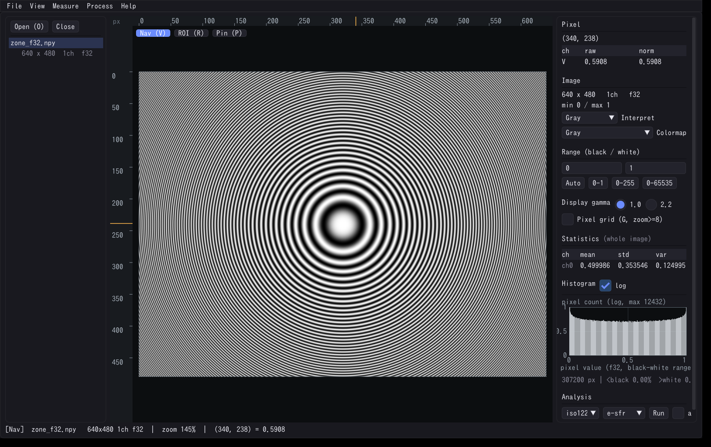
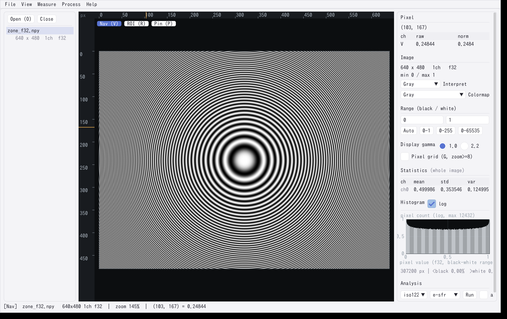
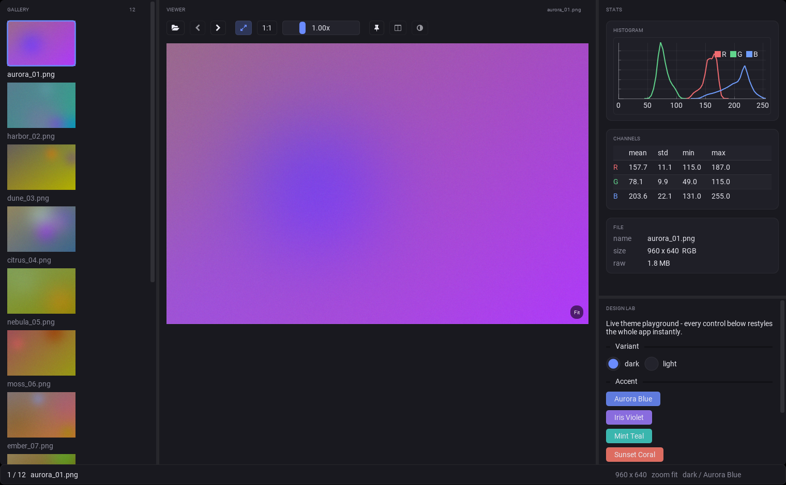
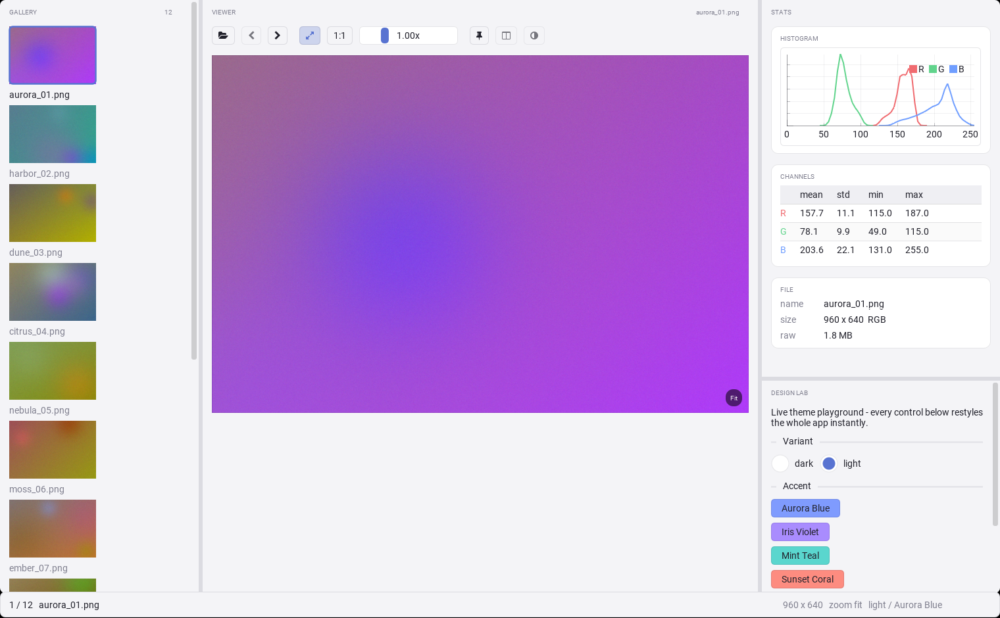
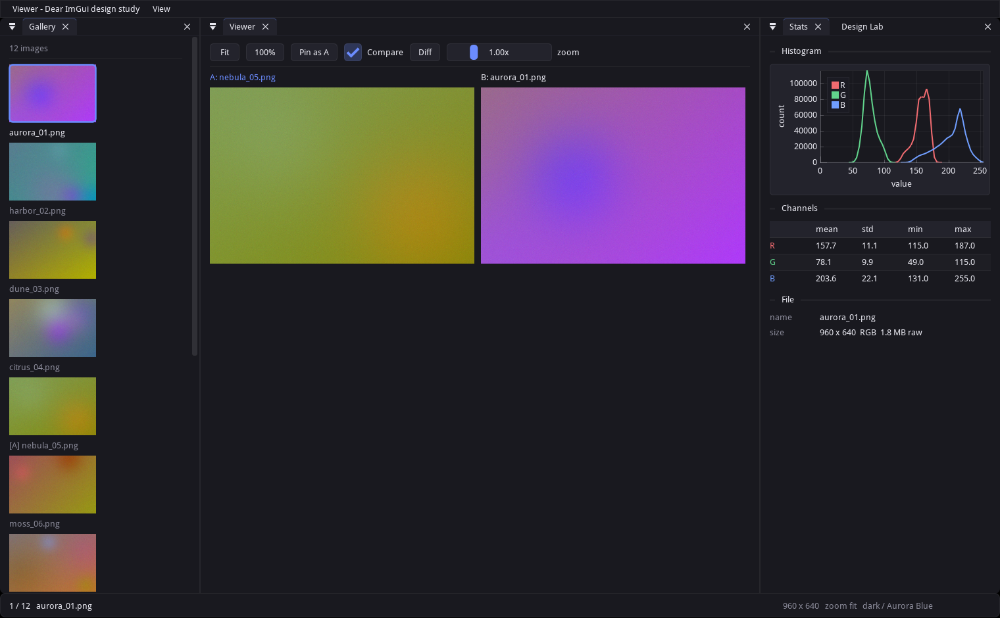

# Dear ImGui モダンデザイン検討 — "Aurora" テーマ

Dear ImGui を「開発のテンションが上がる & 情報が分かりやすい」見た目にするための
デザイン検討です。構成は2点セット:

1. **C++ 本体への適用済みテーマ** — [core/ui_theme.cpp](../../../core/ui_theme.cpp)。
   viewer 起動時に適用され、**View > Theme** でダーク/ライトとアクセント5色を
   実行中に切り替えられます。
2. 本書（設計値と根拠）。

> テーマの出自は Python のデザイン実験場 (`imgui_theme.py` / `imgui_demo.py`) で、
> 値が C++ に移った時点でそちらは役目を終えたため 2026-08-03 に削除しました。
> 以下の Python 版に関する記述は、設計値の由来としてそのまま残しています。

## スクリーンショット(C++ 本体)

**ダーク(既定)**

**ライト(View > Theme > Light、実行中に切替)**

画像キャンバスとルーラーは、どちらのテーマでも暗色のままです。計測対象の画像を
見やすく保ち、周辺 UI の外観だけを切り替える設計です。

## Python デモ(デザイン実験場) — 撤去済み

`imgui_demo.py` / `imgui_theme.py` / `requirements-imgui.txt` は 2026-08-03 の
9023c64 で削除したため、**現在は実行できません**。以下は設計値の由来を示す記録であり、
実行手順ではありません。値の正典は [core/ui_theme.cpp](../../../core/ui_theme.cpp) です。

ギャラリー | ビューア | 統計というレイアウトのモックで、Design Lab パネルから
ダーク/ライト・アクセント色・角丸を**その場で**動かせました。画像・サムネイル・
ヒストグラムはすべて手続き生成でした。

**ダーク**

**ライト**

**A/B 比較モード**

## デザインコンセプト

> 「静かなグレー + アクセント1色」— 主役は常に画像。UI は一歩引く。

ImGui のデフォルトテーマから変更した主要点は4つです。これらを組み合わせて、
情報の階層と現在の操作対象を判別しやすくします。

1. **レイヤー化した背景色** — 真っ黒/真っ白を使わず、
   「アプリ背景 → パネル → 入力部品」の3段階の明度差で奥行きを作る。
   さらに僅かに青方向へシフトさせ、"設計されたグレー"にする。
2. **アクセントは1色だけ** — 選択・チェック・スライダー・アクティブタブの
   オーバーラインなど「今どこ/何が選ばれているか」にのみ使う。
   ボタンはニュートラル。色数を絞ることが分かりやすさに直結する。
3. **角丸と余白** — `FrameRounding 4`(Roomy は 5)/ `WindowRounding 8` と、
   デフォルトより一回り広い `FramePadding` / `ItemSpacing`。
   ImGui が窮屈に見える最大の原因は余白不足。数値は下の表が正典。
4. **境界線はヘアライン** — 不透明な枠線をやめ、
   `rgba(255,255,255,0.06)`(ライトでは黒の10%)の極薄ラインに。
   区切りは「線」ではなく「明度差」で見せる。

## カラーパレット(ダーク)

| 役割 | 値 (sRGB) | 用途 |
| --- | --- | --- |
| bg0 | `#131318` | ドックスペース / アプリ背景 |
| bg1 | `#19191F` | ウィンドウ、メニューバー |
| bg2 | `#23232C` | 入力部品、ボタン、テーブルヘッダ |
| text | `#E8E8F0` | 本文 |
| text dim | `#8A8A99` | 補助情報(ファイル名、ラベル) |
| hairline | `#FFFFFF` @6% | 境界線、セパレータ |
| accent | `#6B8CFF`(Aurora Blue) | 選択・フォーカスの表示のみ |

アクセントはプリセット5色(`ui_theme.cpp` の `ACCENTS`: Aurora Blue / Iris Violet /
Mint Teal / Sunset Coral / Citrus Lime)から **View > Theme** で選べます。
ライトバリアントでは同じアクセントを自動で 18% 暗くしてコントラストを確保します
(`applyLight` の `scaleRgb(accent, 0.82f)`)。

## 形状・余白の設計値

**2系統あります**: 既定は **Compact**(データ表が主役の本体向け)、`View > Compact UI` を
外すと Roomy(ショーケース向けの余裕ある値)になります。実装は
[core/ui_theme.cpp](../../../core/ui_theme.cpp) の `applyShapes(style, compact)`。

| パラメータ | **Compact(既定)** | Roomy | メモ |
| --- | --- | --- | --- |
| WindowRounding / PopupRounding | 8 px | 8 px | パネルは大きめの角丸 |
| FrameRounding / GrabRounding | 4 px | 5 px | 低い部品が丸すぎないように |
| TabRounding | 6 px | 6 px | |
| **FramePadding** | **7 × 3** | 9 × 5 | 行高の主要因。y=3 が下限(枠線が文字に触れる) |
| **ItemSpacing** | **8 × 3** | 9 × 7 | 行ピッチの主要因 |
| **CellPadding** | **6 × 2** | 8 × 4 | 表の行高。y=2 が下限(罫線が潰れる) |
| ItemInnerSpacing | 6 × 3 | 8 × 6 | |
| WindowPadding | 10 × 6 | 12 × 10 | |
| IndentSpacing | 16 | 20 | ツリー(フォルダ選択) |
| ScrollbarSize / GrabMinSize | 10 px | 12 px | 背景透過 + 丸グラブで存在感を消す |
| SeparatorText Padding / Border | 12×2 / 1 | 18×4 / 2 | |
| Border 全般 | 1 px ヘアライン | 同左 | 色側で薄くする(形状は 1px のまま) |

17px フォントでの実効値: フレーム高 **23px**(Roomy 27)、フレーム行ピッチ **26px**(34)、
表の行(チェックボックス入り)**27px**(35)。データ表で約 **+24% の行数**が入ります。
**フォントサイズ(17px)とグラフの軸マージンは削らない**——情報そのものを削ると
別のもっと悪い問題になります。

タブは「選択タブの上辺にアクセントのオーバーライン」
(`ImGuiCol_TabSelectedOverline`)を使うのがポイントで、
ブラウザ風の"今ここ"表示になります(ImGui 1.90.9+)。

## 「ImGui 感」を消す実装テクニック

テーマ(色・角丸・余白)だけでは ImGui 特有の見た目は消えません。
撤去済み Python デモに実装されていた手法を、原因 → 対策で整理した記録です
(`実装` 列はそのデモの関数名。本体側の該当状況は最後の節)。

| ImGui っぽさの原因 | 対策 | 実装 |
| --- | --- | --- |
| デフォルトフォント(ProggyClean)のドット感 | 実フォントを読み込む(デモは Roboto 16px、**本体は 17px** — 下の「フォントについて」) | `_load_fonts()` |
| テキストだけのボタン列 | FontAwesome をマージしてアイコンツールバー化、説明はツールチップに逃がす | `icon_button()` |
| ドッキングのタブバー・×ボタン・▼メニュー | `DockNodeFlagsPrivate_.no_tab_bar` で全ノードのタブバーを消し、代わりに小さな大文字ヘッダを描く | `panel_header()`, `NO_TAB_BAR` |
| メニューバー("Debug" 的な佇まい) | メニューバー自体を廃止し、操作はツールバーへ | `show_menu_bar = False` |
| パネルがベタっと連続する | `docking_separator_size = 6` + 暗色セパレータで、パネル間に「溝」を作る | テーマ側 |
| 情報が1枚のパネルに縦積み | 統計をカード(角丸 child + 明度+1 の背景)に分割 | `begin_card()` / `end_card()` |
| implot の枠・背景・凡例枠 | plot_bg / frame_bg / border を透明化しチャートだけ見せる | `gui_stats()` |
| ウィジェットが左上にへばりつく | 画像をペイン中央に配置し、ヘアライン枠 + ズーム表示ピルを重ねる | `gui_viewer()`, `_zoom_pill()` |

ポイントは「**タブバーとメニューバーとデフォルトフォントの3つを消した時点で
ImGui とはほぼ分からなくなる**」ことです。残りは仕上げの密度調整です。

## ImGui で見づらくなりがちな部分と回避策

- **小さい文字・低コントラスト** → ベースを十分大きく(デモ 16px / 本体 17px)取り、
  `push_font(None, size)`(ImGui 1.92 の動的フォント)で見出しを使い分ける。
- **ボタンの機能が分からない** → アイコン + `set_item_tooltip()`
  にショートカットを併記("Fit to window (F)" など)。
- **表が詰まって読めない** → テーブルは `cell_padding (10,6)` +
  `row_bg` の縞、数値は右揃えでなく列固定。
- **無効状態が分かりにくい** → `begin_disabled()` を必ず使い、
  独自のグレーアウトをしない(テーマの text_disabled が効く)。
- **凡例やグリッドがうるさいグラフ** → 目盛りラベルは X 軸のみ、
  Y 軸は `no_tick_labels`、凡例は水平でプロット内右上。
- **今どのモードか分からない** → トグル系(Fit / Compare)は
  アクティブ時にアクセント色のピル背景で状態を示す。

## 分かりやすさのための UI ルール

- **選択サムネイルはアクセント枠 2.5px + ファイル名を明色に**。
  非選択のファイル名は text dim。一覧の中で現在地が一目で分かる。
- **ピン留め(A)は `[A]` プレフィックス + ビューア側ヘッダをアクセント色に**。
  比較モードで「どちらが基準か」を迷わない。
- **ステータスバーは左=位置(n/N とファイル名)、右=状態(解像度・ズーム)**
  という固定レイアウト。視線移動が安定する。
- ヒストグラムの RGB は意味色(赤/緑/青)で固定し、テーマの影響を受けない。

## 実装メモ

- テーマは**素の ImGui スタイル値を設定するだけ**です。実装は
  [core/ui_theme.cpp](../../../core/ui_theme.cpp) **だけ**で、同期先はもうありません
  (`imgui_theme.py` は撤去済み)。値を変えるならそこ一箇所。
- デモは [imgui-bundle](https://github.com/pthom/imgui_bundle) の
  hello_imgui(docking レイアウト)+ immvision(numpy 画像表示)+
  implot(ヒストグラム)を使用。
- hello_imgui は ini に保存したテーマを起動後に再適用するため、
  デモでは `remember_theme = False` にした上で毎フレーム
  `pre_new_frame` からテーマを適用しています(スタイル値の代入のみで軽量)。
- デモの Design Lab パネルで ダーク/ライト・アクセント色・角丸を実行中に変更
  できました。本体で実行中に変えられるのは **View > Theme**(ダーク/ライトと
  アクセント5色)と **View > Compact UI**(Compact / Roomy)です。
- `img/imgui_*.png` はそのデモの画面で、再生成する手段はもうありません
  (`img/viewer_*.png` が本体の画面)。

## フォントについて

本体は **17px** で、OS ごとの候補(Windows: Meiryo / Yu Gothic / MS Gothic、
macOS: ヒラギノ角ゴシック、Linux: Noto Sans CJK)から先に見つかったものを
`jpFontPath()` が自動検出します(`core/main.cpp`)。撤去済みデモは同梱の
**Roboto Regular 16px** + FontAwesome(アイコン)でした。
ImGui 1.92 以降はグリフを動的に読み込むため、グリフ範囲の指定は不要です。

## C++ 本体への適用状況

| 項目 | 状態 |
| --- | --- |
| Aurora テーマ(色・角丸・余白) | ✅ `core/ui_theme.cpp` — 起動時に適用 |
| ダーク/ライト + アクセント5色の実行時切替 | ✅ View > Theme メニュー |
| 選択状態のアクセント表示(ツールピル等) | ✅ ツールストリップは選択中=アクセント塗り+白文字 |
| クリアカラーのテーマ連動 | ✅ `ui_theme::clearColor()` |
| 実フォント | ✅ 既存実装(Meiryo / ヒラギノ / Noto CJK を 17px で自動検出) |
| セパレータの「溝」/ タブのオーバーライン | ✅ テーマに内包(該当ウィジェット使用時に有効) |
| テーマ設定のセッション保存 | ⬜ 未対応(.vsession に `theme`/`accent` を足すだけ) |

C++ 側は vanilla ImGui 1.91 の範囲だけで実装しています(docking 専用色や
1.92 の新色は不使用)。Python デモにある `no_tab_bar` やカード UI は
docking/hello_imgui 前提のテクニックなので、固定3ペイン構成の本体には
そのまま該当しません——本体は元からタブバーレスなので既に達成済みです。
