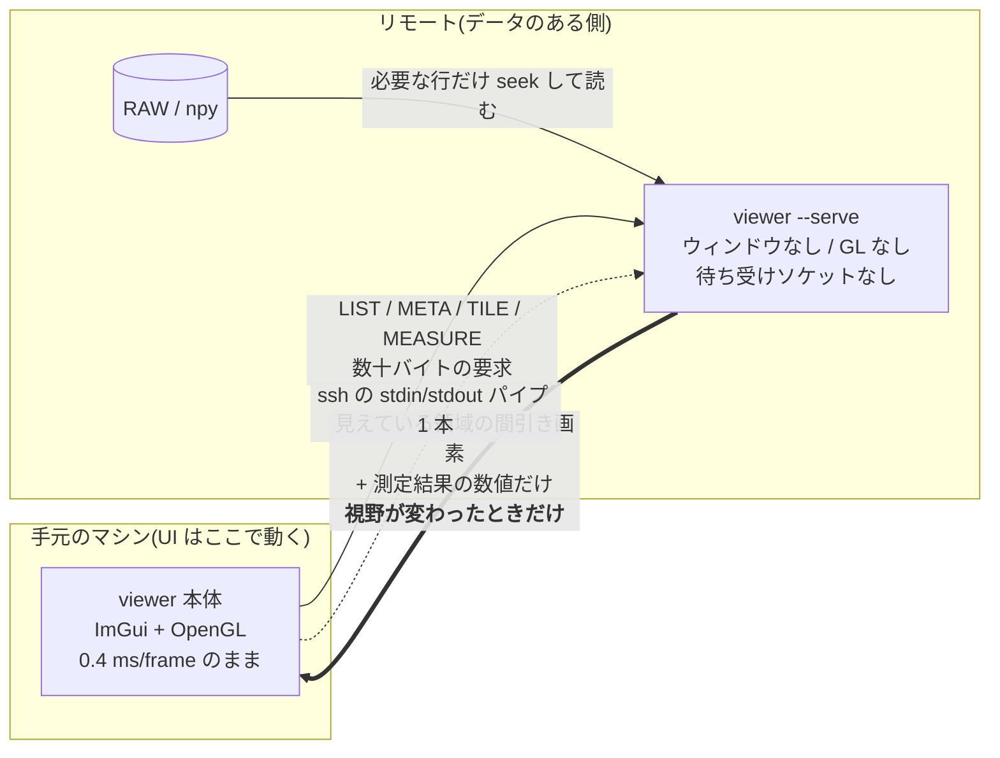

# リモートのデータを手元から見る (`ssh://`)

計算機に置いた大量の RAW/npy を、手元のマシンの viewer から開いて測るための仕組み。
実装中の機能です(v1、[core/remote_proto.h](../core/remote_proto.h) /
[core/serve.cpp](../core/serve.cpp) / [core/remote.cpp](../core/remote.cpp))。

---

## 2. 新しい設計 — GUI を転送するのをやめる

**転送するのは画素と数値だけ。GUI は転送しない。**

- **UI は手元のマシンで動く。** ネイティブ実行(Windows / Linux / macOS)は本ツールの
  必須要件で、そこは変えません。ローカルの 0.4 ms/frame をそのまま維持します。
- **リモートには同じバイナリを `--serve` で起動したものが待つ。**
  ウィンドウを作らず、OpenGL を初期化せず、ソケットも開かない。stdin から要求を読んで
  stdout に返事を書くだけのプロセスです。
- 手元の viewer は「ファイルを読む」代わりに「見えている領域を要求する」。
  画面に出る画素の分だけが線を通ります。



肝は 2 つ。**(1) 送るのは画面に映る分だけ**(12 Mpx ではなく 1.3 Mpx)、
**(2) 送るのは視野が変わったときだけ**(毎フレームではない)。
文字入力・ROI のドラッグ・メニュー操作では、**画素は 1 バイトも流れません**。

---

## 3. なぜ ssh の標準入出力なのか

手元の viewer が

```
ssh -o BatchMode=yes user@host viewer --serve
```

を起動し、**その子プロセスの stdin/stdout と会話する**だけです
([core/remote.cpp](../core/remote.cpp) の `Session::start`)。

`-o BatchMode=yes` を付けているので、**公開鍵認証(または ssh-agent / ControlMaster)が
前提**です。パスワード入力を求められる接続は、GUI 側に打ち込む端末がないため
即座に失敗させます(ハングするより速く原因が分かる)。

---

## 4. 何がネットワークを流れるのか

プロトコルは [core/remote_proto.h](../core/remote_proto.h)。フレーミングは
`[magic][type][len][payload]` の 12 バイトヘッダのみ。要求は 6 種類です。

| メッセージ | 要求 | 返答 | 典型サイズ |
|---|---|---|---|
| `MSG_LIST` | パス | ディレクトリ項目(名前 / dir / サイズ / mtime / npy ヘッダの形状・dtype、連番は 1 グループ行に集約) | 数百 B 〜 数十 KB |
| `MSG_META` | パス | `w, h, ch, dtype, frames` | **24 バイト** |
| `MSG_TILE` | パス + frame + 矩形 + `step` | 間引き済み画素(**元の dtype のまま**) | 下記 |
| `MSG_MEASURE` | パス + ROI + アナライザ名 | 測定結果の数値 | 数十バイト〜数十 KB |
| `MSG_GLOB` | ルート + パターン + 深さ/件数上限 | 一致した相対パス(打ち切りフラグ付き) | 数 KB |
| `MSG_SCAN` | ルート + 深さ/件数上限 | サブフォルダごとのスタック一覧(リモート版 Open Folder) | 数 KB |

LIST の拡張・GLOB・SCAN はプロトコル 3。相手が 2 のときはサーバが v2 形式で
LIST を返し、クライアントは形状・日時列を「-」表示にしてブラウズ自体は続く。

Browse パネルの表示モードと通信量の関係:

| 操作 | 追加の往復 |
|---|---|
| grouped ⇄ flat(連番の展開) | **0**。`.members` は最初の LIST に必ず入っている |
| tree でノードを展開 | そのノードの `MSG_LIST` **1 回だけ**(ワーカースレッド) |
| tree でノードを畳む | 0。子はキャッシュに残り、開き直しても 0 |
| refresh / 別ホストへ接続 | キャッシュ破棄(次の展開で再取得) |

### TILE の `step` が肝

`TileReq` の `step` はサンプル間引きの刻みです。**「画面で見えている解像度以上は送らない」**
という一点だけで、転送量が桁で変わります。

**ケース A: 4000x3000 の f32 画像を 1000 px のペインにフィット表示**

| | 値 |
|---|---|
| 元データ | 4000x3000 = 12 Mpx、f32 → ファイル上 48 MB |
| ペイン高さ | 1000 px → `step = 3` |
| 実際に送るサンプル数 | 1333 x 1000 = **1.33 Mpx**(12 Mpx ではない) |
| 生バイト数 | 1.33 Mpx x 4 B = **5.3 MB** |
| deflate 後 | **概算 2〜4 MB**(センサデータの圧縮率次第。クライアントは常に圧縮を要求) |
| リモート側がディスクから読む量 | **概算 16 MB**(1000 行 x 4000 px x 4 B。48 MB 全部は読まない) |
| 送るタイミング | **この 1 回だけ**。以後どれだけ操作しても再送なし |

**ケース B: 等倍(1:1)で一部を拡大**

| | 値 |
|---|---|
| 見えている矩形 | 例 1000 x 700 px、`step = 1` |
| 送るサンプル数 | 0.7 Mpx → 生 **2.8 MB**、deflate 後 概算 1〜2 MB |
| ディスク読み | 700 行 x 1000 px x 4 B = **2.8 MB** |

`step` は「そもそも見えない情報を送らない」ための仕掛けなので、
**画像が大きくなっても転送量はペインの大きさで頭打ち**になります。
12 Mpx でも 50 Mpx でも、1000 px のペインに映る限りコストはほぼ同じ。

### 送らないとき

| 操作 | 流れるもの |
|---|---|
| 文字入力(ファイル名フィルタ、数値入力) | **0 バイト** |
| ROI のドラッグ・リサイズ | **0 バイト**(統計は手元にあるタイルから計算) |
| メニュー・パネル配置・テーマ変更 | **0 バイト** |
| 黒点/白点・ガンマ・カラーマップ変更 | **0 バイト**(表示変換は手元の画素に対して行う) |
| パン / ズーム(視野が変わった) | TILE 1 回 |
| フレーム送り(`←→`) | TILE 1 回 |

### ディスクからも必要分しか読まない

[core/serve.cpp](../core/serve.cpp) の `readRegion()` は、フレームをメモリに載せません。
要求された行だけを `seekg` で拾い、**読みながら間引きます**。

```cpp
for (uint32_t y = y0, oy = 0; oy < outH; y += step, oy++) {
    n.f.seekg((std::streamoff)(base + ((uint64_t)y * n.w + x0) * px));
    n.f.read((char*)row.data(), (std::streamsize)row.size());
    ...
}
```

`y += step` なので、`step = 3` なら**行を 3 本に 1 本しか読まない**。48 MB のファイルに
対するディスク I/O は概算 16 MB で済み、ページキャッシュも汚しません
(`NpyFile` の設計方針コメント: 「A reader, not a loader」)。
`n.bigEndian` のバイトスワップもサーバ側で済ませるので、手元は素直に読めます。

### MEASURE — 解析はデータのある側で

`MSG_MEASURE` は「ROI とアナライザ名を送り、**数値だけ**返す」ための予約枠です。
PRNU も e-SFR もノイズフロアも、入力は数 Mpx あっても出力は
`mean=512.3, std=4.71, MTF50=0.31` のような**数十バイト**。
画素をこちら側に引いてから測るのは、答えを得るために原料を輸送しているようなものです。
解析プラグインはリモート側で走らせ、結果だけ持ってくるのが正しい。

---

## 7. 使い方(予定)

```bash
viewer ssh://user@host/data/run42
```

これだけ。内部では
`ssh -o BatchMode=yes user@host viewer --serve` が起動し、`/data/run42` を LIST します。

- リモート側の準備は**同じ `viewer` バイナリが PATH にあること**だけ。
- `~/.ssh/config` の Host エイリアスがそのまま使えます(`ssh://dev-box/data/run42`)。
- 既存のローカル起動は一切変わりません。パスがローカルなら従来通りローカルで読みます。

デバッグ用に、ホストを空にするとローカルで `viewer --serve` を起動して同じ経路を通します
(`Session::start` の `host.empty()` 分岐)。プロトコルの検証はネットワークなしでできます。

---

## 8. 制限と今後(実装中)

**この節の内容は実装中につき変わります。** 現時点(v1)の状態:

| 項目 | 状態 |
|---|---|
| **対応フォーマット** | **`.npy` のみ**。`parseNpyHeader` が u8/i8/u16/i16/u32/i32/f32/f64 と 2〜4 次元の shape を扱う |
| **ベタ RAW** | 未対応。RAW はヘッダを持たないので、**手元で指定したレシピ(画素フォーマット x 解釈 x 寸法)をサーバに送る**必要がある。プロトコルに枠がまだない |
| **Fortran order の .npy** | サーバは明示的に拒否(`"fortran-order .npy is not served (open it locally)"`)。行 seek が成立しないため |
| **`MSG_MEASURE`** | **実装済み**(`serve.cpp` `handleMeasure`)。`MOP_TEMPORAL_STATS` と `MOP_FRAME_ROI_STATS` がサーバ側で走り、結果だけが返る。タイルを引いて手元で測るのは `--remote-policy local-fetch` の経路 |
| **先読み(prefetch)** | 実装済み(`rfWorker`)。`Session` は**スレッドセーフではない**ので、**1 つの `Session` には所有スレッドが 1 つだけ**という規律で回す(下の所有表)。共有して mutex で守るのは誤り — 片側しか取らない mutex は何も守らないし、両側が取れば片方のネットワーク I/O の間じゅう他方が止まる |
| **`ssh://` の CLI 配線** | `remote::parseUrl` はあるが、起動パスへの接続はこれから(`--serve` 側は `main.cpp` に配線済み) |
| **LIST のファイルサイズ** | 32 bit にクランプされる(4 GB 超は頭打ち表示) |
| **圧縮** | deflate(miniz)固定、level 6。クライアントは常に要求し、縮まなかったときだけ生で返る |
| **並列・キャンセル** | なし。1 要求 1 返答の同期往復。パン中に古い要求を捨てる仕組みはまだない |

### `Session` の所有(鉄則)

`rp::Header` には**要求 ID が無い**。`Session::recv` は「次に届いたヘッダ」を
そのまま消費するので、2 スレッドが 1 本の ssh の stdin にフレームを書けば
返答が食い違い、ストリームは**恒久的に**ずれる。加えて `stop()` は `Pipe` を
`delete` するので、読んでいる最中の相手は use-after-free になる。
したがって **1 `Session` = 1 所有スレッド**:

| Session | 所有者 | 用途 |
|---|---|---|
| `app.rbSession` | `rbWorker` | CONNECT / LIST / SCAN / GLOB / 木の展開 / 切断 |
| `app.uiSession` | UI スレッド | `openRemote` の META + TILE(プレビューと最初の 1 枚) |
| `rfWorker` のローカル `Session` | `rfWorker` | 全解像度 TILE の先読み |
| `mWorker` のローカル `Session` | `mWorker` | MEASURE(サーバ側集計) |

所有者以外は `Session` に**触れない**。UI が必要とする値(`peerVersion` /
`bytesReceived` / 生死)は所有スレッドが `RbResult` に載せて返し、UI は
`App::RemoteBrowse` の**ただの値**を読む。ホストあたり ssh チャネルは
最大 4 本になるが、これは競合と UI フリーズの両方を同時に消す唯一の形。

**次にやること**(優先順):

1. `ssh://` URL の起動パス配線 + LIST/META をファイルブラウザ UI に載せる
2. 先読みスレッド(連番の次フレームを投機的に取りに行く)と、視野が変わったときの
   古い要求のキャンセル
3. `MSG_MEASURE` — アナライザをデータのある側で走らせ、数値だけ返す
4. RAW レシピの転送(META 要求にレシピを添える形が有力)
5. WebSocket transport(`ReplySink` を差し替えるだけ。[.background/remote.md](.background/remote.md) §5 参照)

---

## 関連

- [core/remote_proto.h](../core/remote_proto.h) — ワイヤフォーマットの定義
- [core/serve.cpp](../core/serve.cpp) — `viewer --serve`。`readRegion()` が間引き読みの本体
- [core/remote.cpp](../core/remote.cpp) — 手元側の `Session`
- [ARCHITECTURE.md 「性能の建付け」](../ARCHITECTURE.md#性能の建付け-計測してから議論する) —
  毎フレーム処理の不変条件と再描画ポリシー。`View > Low bandwidth` もここ
- [README ロードマップ](../README.md#ロードマップ) — 項目 5 の WebSocket ブリッジ

経緯と検討: [.background/remote.md](.background/remote.md)
